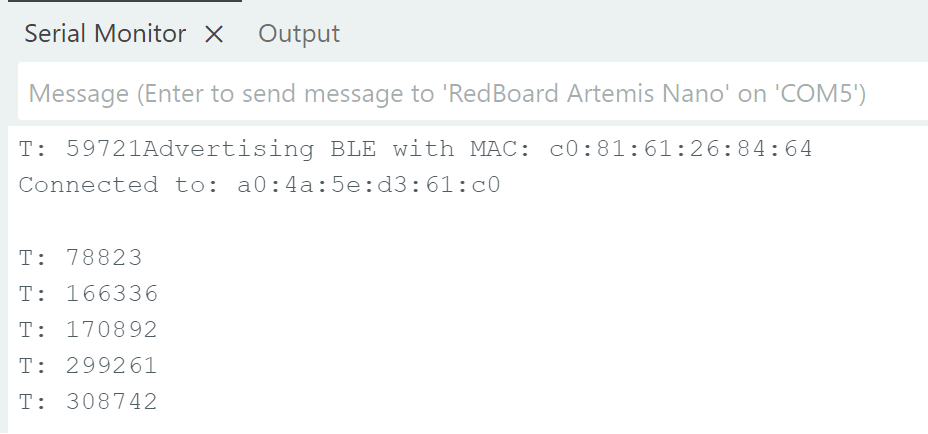
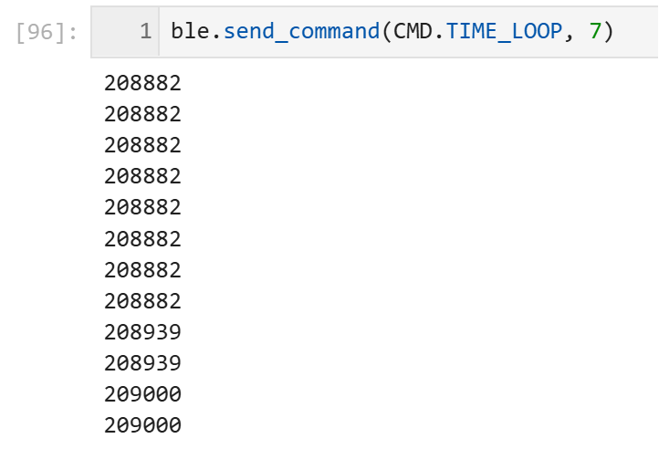

# LAB 1 - MAE4190 FAST ROBOTS

Hello! This is lab 1 of fast robots:

## Prelab:
Setup: Briefly describe the steps taken to set up your computer for Lab 1, showing any results (i.e. MAC address printing)
Codebase: Add a brief explanation of your understanding of the codebase and how Bluetooth works between your computer and the Artemis

## Lab Tasks:
Configurations: Show what the relevant configurations, anything that was specifically needed to address the tasks.
Include a brief explanation on what you did and results for each task.
Address all questions posed in the lab.
Include screenshots, screen recordings, pictures, or videos of relevant results (i.e. messages received in Jupyter Notebook, serial terminal print of messages received by Artemis).

#### 3. Add a command GET_TIME_MILLIS which makes the robot reply write a string such as “T:123456” to the string characteristic.

```C++
case GET_TIME_MILLIS:

            tx_estring_value.clear();
            tx_estring_value.append("T: ");
            tx_estring_value.append((int)millis());
            tx_characteristic_string.writeValue(tx_estring_value.c_str());

            Serial.println();
            Serial.print("T: ");
            Serial.print(millis());

            break;
```

```python
ble.send_command(CMD.GET_TIME_MILLIS, "")
print("time")
```
The print statement is just there to test that this line works.
Here's the timestamp printed in the serial monitor:



#### 4. Setup a notification handler in Python to receive the string value (the BLEStringCharactersitic in Arduino) from the Artemis board. In the callback function, extract the time from the string.

```python
def notifyBle(uuid, data):
    data = data.decode()
    if data.startswith("T:"):
        read_time.append(int(data.split(":")[1]))
        print(read_time)
    else:
        print("Unexpected data")
        
ble.send_command(CMD.GET_TIME_MILLIS, "")

ble.start_notify(ble.uuid['RX_STRING'], notifyBle)
```

When this is run, the Jupyter Notebook cell returns the current time stamp to me with the format T: [time_in_ms]

#### 5. Write a loop that gets the current time in milliseconds and sends it to your laptop to be received and processed by the notification handler. Collect these values for a few seconds and use the time stamps to determine how fast messages can be sent. What is the effective data transfer rate of this method?

```C++
case TIME_LOOP:{

            int begin = millis();
            int count = 0; //determining the effective data transfer rate
            int interval = 1000; //how long this is going to run

            while (millis() - begin <= interval){

                tx_estring_value.clear();
                tx_estring_value.append("T:");
                tx_estring_value.append((int)millis());
                tx_characteristic_string.writeValue(tx_estring_value.c_str());

                count++;

            }

            Serial.println();
            Serial.print(count);
            Serial.print(" data points");

            break;
    }
```
This is my code for sending the current time for a certain time frame determined (interval). I chose 1000ms (1s) arbitrarily to test this out, and in order to test for the effective data transfer rate of this method, I counted the number of timestamps that the loop outputs (count) so that we can see it in the serial monitor:




As we can see, it can only send 43 data points per second, and it varies from 37 to 44 typically.

#### 6. Now create an array that can store time stamps. This array should be defined globally so that other functions can access it if need be. In the loop, rather than send each time stamp, place each time stamp into the array. (Note: you’ll need some extra logic to determine when your array is full so you don’t “over fill” the array.) Then add a command SEND_TIME_DATA which loops the array and sends each data point as a string to your laptop to be processed. (You can store these values in a list in python to determine if all the data was sent over.)

Here I placed all my timestamps over 3s into a globally defined time_doc array. Tindex is the index (which is also globally defined) that increments from 0. The delay is to prevent the BLE from overfilling.

```C++
case SEND_TIME_DATA:

            for (int tindex = 0; tindex < 3000; tindex++){
                time_doc[tindex] = millis();

                tx_estring_value.clear();
                tx_estring_value.append("T:");
                tx_estring_value.append((int)time_doc[tindex]);
                tx_characteristic_string.writeValue(tx_estring_value.c_str());
                delay(1);
            }

            break;
```


#### 7. Add a second array that is the same size as the time stamp array. Use this array to store temperature readings. Each element in both arrays should correspond, e.e., the first time stamp was recorded at the same time as the first temperature reading. Then add a command GET_TEMP_READINGS that loops through both arrays concurrently and sends each temperature reading with a time stamp. The notification handler should parse these strings and add populate the data into two lists.

```C++
case GET_TEMP_READINGS:
            
            for (int tindex = 0; tindex < 3000; tindex++){
                
                time_doc[tindex] = millis();
                temp_doc[tindex] = getTempDegC();
                
                tx_estring_value.clear();
                tx_estring_value.append("T:");
                tx_estring_value.append((int)time_doc[tindex]);
                tx_estring_value.append(",Temp:");
                tx_estring_value.append((float)temp_doc[tindex]);
                tx_characteristic_string.writeValue(tx_estring_value.c_str());

                delay(1);

                Serial.println();
                Serial.print(tx_estring_value.c_str());
            }

            break;
```

```python
time_array = []
temp_array = []

def notifyBle(uuid, data):
    data = data.decode()
    if data.startswith("T:") and "Temp" not in data:
        read_time = int(data.split(":")[1])
        time_array.append(read_time)
        print(read_time)
    elif "Temp" in data:
        read_time, read_temp = data.split(",")
        time_array.append(int(read_time.split(":")[1]))
        temp_array.append(float(read_temp.split(":")[1]))
    else:
        print("Unexpected data")
```

arduino C++
command line bash

## Discussion:
Briefly describe what you’ve learned, challenges that you faced, and/or any unique solutions used to fix problems. It is important to keep these writeups succinct. You will not get extra points for writing more words if the content doesn’t contribute to communicating your understanding of the lab material.