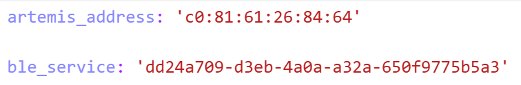
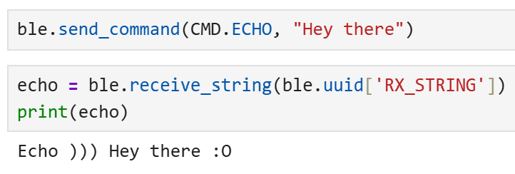

# LAB 1 - MAE4190 FAST ROBOTS

Hello! This is lab 1 of fast robots:

## Prelab:

I did all the installation and successfully activated a virtual environment. Here is my MAC address and UUID and me connecting to the arduino!




Unfortunately my laptop had issues connecting with the Artemis board as it cannot detect any ports. I had to update the CH340 Driver, which was strange since my TA and Professor Helbling said that this was usually a Mac issue.

#### Codebase: Add a brief explanation of your understanding of the codebase and how Bluetooth works between your computer and the Artemis

The BLE codebase is split into two parts, one for the arduino and one for the python. The arduino part of the codebase sends commands to the artemis board, while the python code runs and receives data on our computers, recognizing and connecting with the given MAC address and the UUID of the two devices. The Bluetooth facilitates communication between the Artemis and the computer to send and receive commands as well as data.


## Lab Tasks:

#### 1. Send a string value from the computer to the Artemis board using the ECHO command. The computer should then receive and print an augmented string.

```C++
        case ECHO:

            char char_arr[MAX_MSG_SIZE];

            // Extract the next value from the command string as a character array
                        /*
             * Your code goes here.
             */
            success = robot_cmd.get_next_value(char_arr);
            if (!success)
                return;

            tx_estring_value.clear();
            tx_estring_value.append("Echo ))) ");
            tx_estring_value.append(char_arr);
            tx_estring_value.append(" :O");
            tx_characteristic_string.writeValue(tx_estring_value.c_str());

            Serial.print("Echoo))) ");
            Serial.print(char_arr);
            Serial.println(" :O");
            
            break;
```




#### 2. Send three floats to the Artemis board using the SEND_THREE_FLOATS command and extract the three float values in the Arduino sketch.

```C++
case SEND_THREE_FLOATS:
            /*
             * Your code goes here.
             */
            float fl_1, fl_2, fl_3;

            // Extract the next value from the command string as an integer
            success = robot_cmd.get_next_value(fl_1);
            if (!success)
                return;

            // Extract the next value from the command string as an integer
            success = robot_cmd.get_next_value(fl_2);
            if (!success)
                return;

            success = robot_cmd.get_next_value(fl_3);
            if (!success)
                return;

            Serial.print("Three floats: ");
            Serial.print(fl_1);
            Serial.print(", ");
            Serial.print(fl_2);
            Serial.print(", ");
            Serial.println(fl_3);

            break;
```

```python
ble.send_command(CMD.SEND_THREE_FLOATS, "0.52|6.01|90.7")
```


#### 3. Add a command GET_TIME_MILLIS which makes the robot reply write a string such as “T:123456” to the string characteristic.

```C++
case GET_TIME_MILLIS:

            tx_estring_value.clear();
            tx_estring_value.append("T: ");
            tx_estring_value.append((int)millis());
            tx_characteristic_string.writeValue(tx_estring_value.c_str());

            Serial.println();
            Serial.print("T: ");
            Serial.print(millis());

            break;
```

```python
ble.send_command(CMD.GET_TIME_MILLIS, "")
print("time")
```
(The print statement in the python code is just there to test that this line works.)
Here's the timestamp printed in the serial monitor:


#### 4. Setup a notification handler in Python to receive the string value (the BLEStringCharactersitic in Arduino) from the Artemis board. In the callback function, extract the time from the string.

```python
def notifyBle(uuid, data):
    data = data.decode()
    if data.startswith("T:"):
        read_time.append(int(data.split(":")[1]))
        print(read_time)
    else:
        print("Unexpected data")
        
ble.send_command(CMD.GET_TIME_MILLIS, "")

ble.start_notify(ble.uuid['RX_STRING'], notifyBle)
```

When this is run, the Jupyter Notebook cell returns the current time stamp to me with the format T: [time_in_ms]

#### 5. Write a loop that gets the current time in milliseconds and sends it to your laptop to be received and processed by the notification handler. Collect these values for a few seconds and use the time stamps to determine how fast messages can be sent. What is the effective data transfer rate of this method?

```C++
case TIME_LOOP:{

            int begin = millis();
            int count = 0; //determining the effective data transfer rate
            int interval = 1000; //how long this is going to run

            while (millis() - begin <= interval){

                tx_estring_value.clear();
                tx_estring_value.append("T:");
                tx_estring_value.append((int)millis());
                tx_characteristic_string.writeValue(tx_estring_value.c_str());

                count++;

            }

            Serial.println();
            Serial.print(count);
            Serial.print(" data points");

            break;
    }
```
This is my code for sending the current time for a certain time frame determined (interval). I chose 1000ms (1s) arbitrarily to test this out, and in order to test for the effective data transfer rate of this method, I counted the number of timestamps that the loop outputs (count) so that we can see it in the serial monitor:


As we can see, it can only send 43 data points per second, and it varies from 37 to 44 typically.

#### 6. Now create an array that can store time stamps. This array should be defined globally so that other functions can access it if need be. In the loop, rather than send each time stamp, place each time stamp into the array. (Note: you’ll need some extra logic to determine when your array is full so you don’t “over fill” the array.) Then add a command SEND_TIME_DATA which loops the array and sends each data point as a string to your laptop to be processed. (You can store these values in a list in python to determine if all the data was sent over.)

Here I placed all my timestamps over 3s into a globally defined time_doc array. Tindex is the index (which is also globally defined) that increments from 0. The delay is to prevent the BLE from overfilling.

```C++
case SEND_TIME_DATA:

            for (int tindex = 0; tindex < 3000; tindex++){
                time_doc[tindex] = millis();

                tx_estring_value.clear();
                tx_estring_value.append("T:");
                tx_estring_value.append((int)time_doc[tindex]);
                tx_characteristic_string.writeValue(tx_estring_value.c_str());
                delay(1);
            }

            break;
```


#### 7. Add a second array that is the same size as the time stamp array. Use this array to store temperature readings. Each element in both arrays should correspond, e.e., the first time stamp was recorded at the same time as the first temperature reading. Then add a command GET_TEMP_READINGS that loops through both arrays concurrently and sends each temperature reading with a time stamp. The notification handler should parse these strings and add populate the data into two lists.

```C++
case GET_TEMP_READINGS:
            
            for (int tindex = 0; tindex < 3000; tindex++){
                
                time_doc[tindex] = millis();
                temp_doc[tindex] = getTempDegC();
                
                tx_estring_value.clear();
                tx_estring_value.append("T:");
                tx_estring_value.append((int)time_doc[tindex]);
                tx_estring_value.append(",Temp:");
                tx_estring_value.append((float)temp_doc[tindex]);
                tx_characteristic_string.writeValue(tx_estring_value.c_str());

                delay(1);

                Serial.println();
                Serial.print(tx_estring_value.c_str());
            }

            break;
```

```python
time_array = []
temp_array = []

def notifyBle(uuid, data):
    data = data.decode()
    if data.startswith("T:") and "Temp" not in data:
        read_time = int(data.split(":")[1])
        time_array.append(read_time)
        print(read_time)
    elif "Temp" in data:
        read_time, read_temp = data.split(",")
        time_array.append(int(read_time.split(":")[1]))
        temp_array.append(float(read_temp.split(":")[1]))
    else:
        print("Unexpected data")
```

[](https://www.youtube.com/watch?v=_pmVKVNQdQs)

I had to make some modifications for my notification handler due to the appended temperature readings as well, and they are now stored in two arrays, time_array and temp_array. Unfortunately, while my Arduino code supposedly works, as tested by the Serial.print of the estring, it does not output anything in Jupyter Notebook. I have tried to troubleshoot this, but cannot find an answer as of now. If there is some blatant mistake causing this, I am very sorry. I will continue to experiment with testing to find the cause.

#### 8. Discuss the differences between these two methods, the advantages and disadvantages of both and the potential scenarios that you might choose one method over the other. How “quickly” can the second method record data? The Artemis board has 384 kB of RAM. Approximately how much data can you store to send without running out of memory?

The first method is straight forward, takes up less memory since nothing is really stored in the Artemis, as well as allows messages to be sent and received immediately. However, as shown from the duplicating timestamps in the display, this is limited by the bandwidth of the bluetooth, and the messages send faster than the computer can receive them, leading to inconsistent, repeating timestamps being shown.

The second method stores data and sends them over all at once in even intervals, instead of the rapid-fire, less organized messages. This is no longer limited by the bandwidth of the bluetooth, but there are other issues that could arise, such as in overfilling arrays and taking up more memory on the board.

When there is a large quantity of data, and the specific time at which data is being sent matters less, the first method would be better as there would be no worries about running out of memory. However, if the timestamps need to be more precise, especially if sent at high speeds, the second option may be better.
The speed of the second method recording data would probably depend on the speed at which the measurements are being sent in, such as the sensor being used.

For 384kB, each string contains bytes for the characters of "T:" and ",Temp:", as well as six digits each for all numerical data. In total, this string should have around 17 bytes. So dividing the memory by the number of bytes, we can potentially store around 22500 data entries.

## Discussion:

I learned a lot more about communicating via Bluetooth, and got more familiar with the C++ language in general. Troubleshooting with different print statements became very useful, and it gave me a lot of insight into how transmitting data and sending commands worked through Arduino and python.