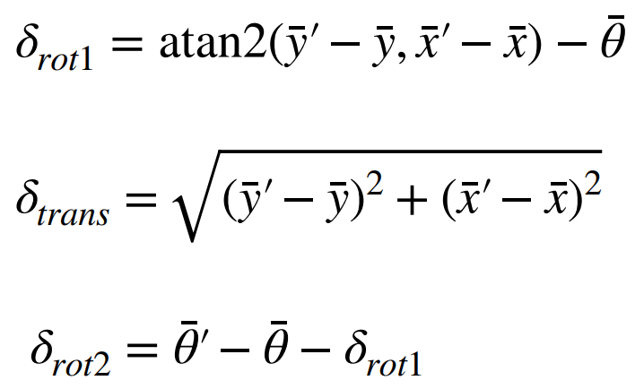
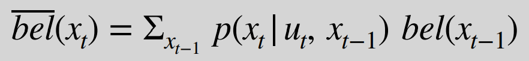
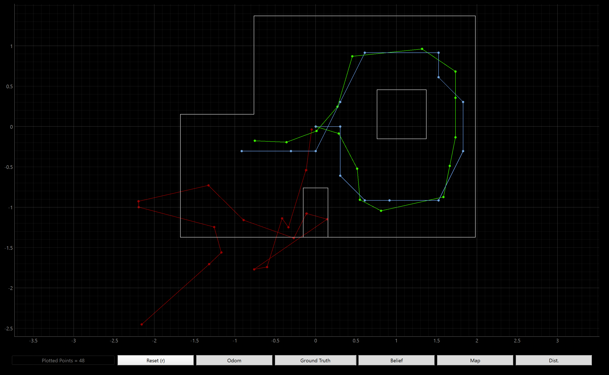

# LAB 10 - MAE4190 FAST ROBOTS

This is lab 10 of fast robots. In this lab, we are implementing grid localization using the Bayes Filter. We are using a simulator that will plot the ground truth, odometry and belief of the locations of the car.

## Implementing the Functions

### compute_control

I extract the needed information from the given data and calculate the odomoetry model parameters from the equations we learned during lecture:



```python
def compute_control(cur_pose, prev_pose):
    ...

    delta_rot_1 = np.arctan2( (cur_y - prev_y), (cur_x - prev_x) ) - prev_yaw
    delta_trans = np.sqrt( (cur_y - prev_y)**2 + (cur_x - prev_x)**2 )
    delta_rot_2 = cur_yaw - prev_yaw - delta_rot_1

    #normalize the two angles
    delta_rot_1 = mapper.normalize_angle(delta_rot_1)
    delta_rot_2 = mapper.normalize_angle(delta_rot_2)

    return delta_rot_1, delta_trans, delta_rot_2
```

### odom_motion_model

For each of the rotations and translational motions of the pose, we use Gaussians to model their changes and compare the predicted control state to what the robot is actually doing. The compute_control function is used here to compare the pose to the given u.

```python
def odom_motion_model(cur_pose, prev_pose, u):
    ...
    rot1 = u[0]
    trans = u[1]
    rot2 = u[2]

    rot1_hat, trans_hat, rot2_hat = compute_control(cur_pose, prev_pose)

    #Returns the relative likelihood of x in a Normal Distribution with mean mu and standard deviation sigma.
    prob = loc.gaussian(mapper.normalize_angle(rot1_hat - rot1),0, loc.odom_rot_sigma) * loc.gaussian(trans_hat-trans, 0, loc.odom_trans_sigma) * loc.gaussian(mapper.normalize_angle(rot2_hat-rot2), 0, loc.odom_rot_sigma)
    
    return prob
```

### prediction_step

The prediction step of the Bayes Filter needs to take the belief distributions of the robot's every previous step, propagate them through the motion model, and combine them to give a belief distribution of where the robot's next state will be. 



```python
def prediction_step(cur_odom, prev_odom):
    ...
    u = compute_control(cur_odom, prev_odom);

    loc.bel_bar = np.zeros((mapper.MAX_CELLS_X, mapper.MAX_CELLS_Y, mapper.MAX_CELLS_A))

    for px in range(mapper.MAX_CELLS_X):
        for py in range(mapper.MAX_CELLS_Y):
            for pa in range(mapper.MAX_CELLS_A):
                prev_pose = mapper.from_map(px, py, pa)

                for cx in range(mapper.MAX_CELLS_X):
                    for cy in range(mapper.MAX_CELLS_Y):
                        for ca in range(mapper.MAX_CELLS_A):
                            curr_pose = mapper.from_map(cx, cy, ca)
                            prob = odom_motion_model(curr_pose, prev_pose, u)
                            loc.bel_bar[cx, cy, ca] += prob * loc.bel[px, py, pa]
    
    #normalize
    loc.bel_bar /= np.sum(loc.bel_bar)
```

### sensor_model


def sensor_model(obs):
    """ This is the equivalent of p(z|x).


    Args:
        obs ([ndarray]): A 1D array consisting of the true observations for a specific robot pose in the map 

    Returns:
        [ndarray]: Returns a 1D array of size 18 (=loc.OBS_PER_CELL) with the likelihoods of each individual sensor measurement
    """
    prob_array = loc.gaussian(loc.obs_range_data.flatten(), obs, loc.sensor_sigma)

    return prob_array

def update_step():
    """ Update step of the Bayes Filter.
    Update the probabilities in loc.bel based on loc.bel_bar and the sensor model.
    """
    likelihoods = np.prod(loc.gaussian(loc.obs_range_data.flatten(), mapper.obs_views, loc.sensor_sigma),axis=3)
    loc.bel = likelihoods * loc.bel_bar
    loc.bel /= np.sum(loc.bel)


