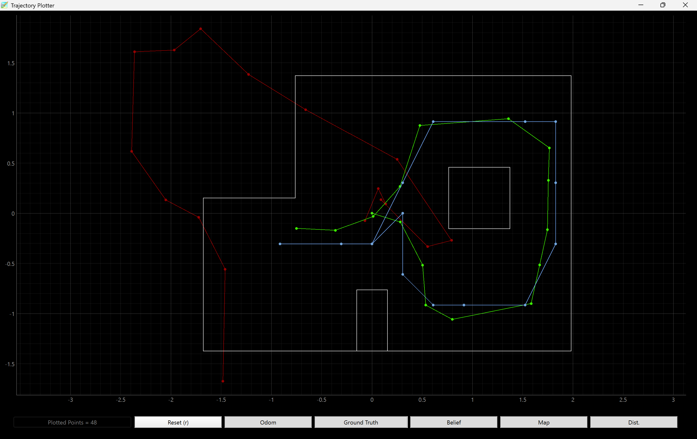
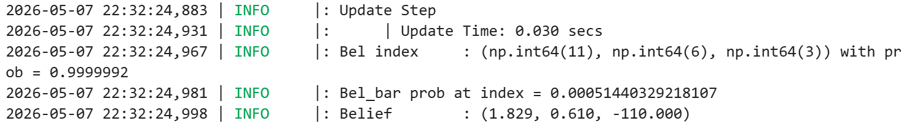
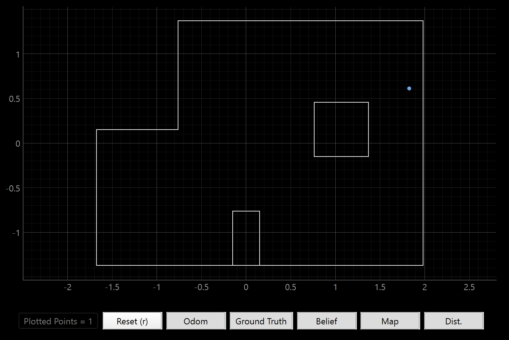
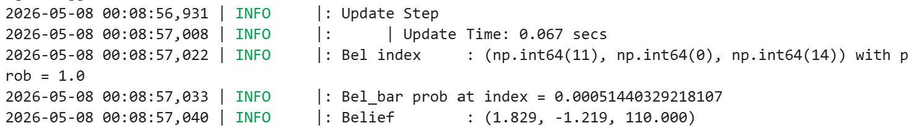
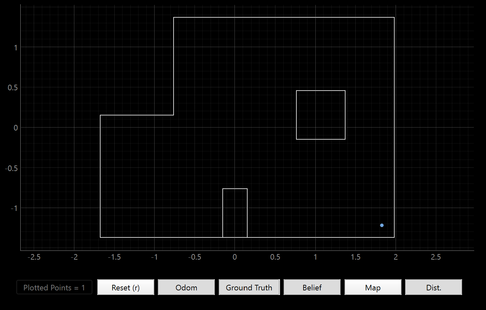
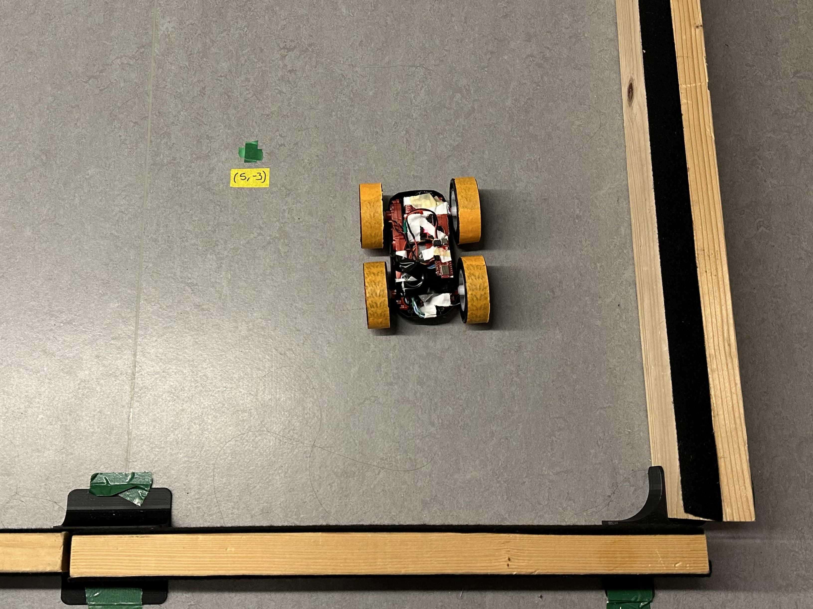
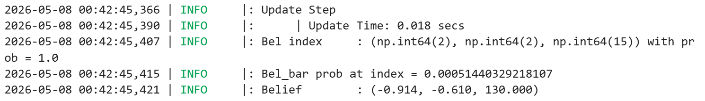
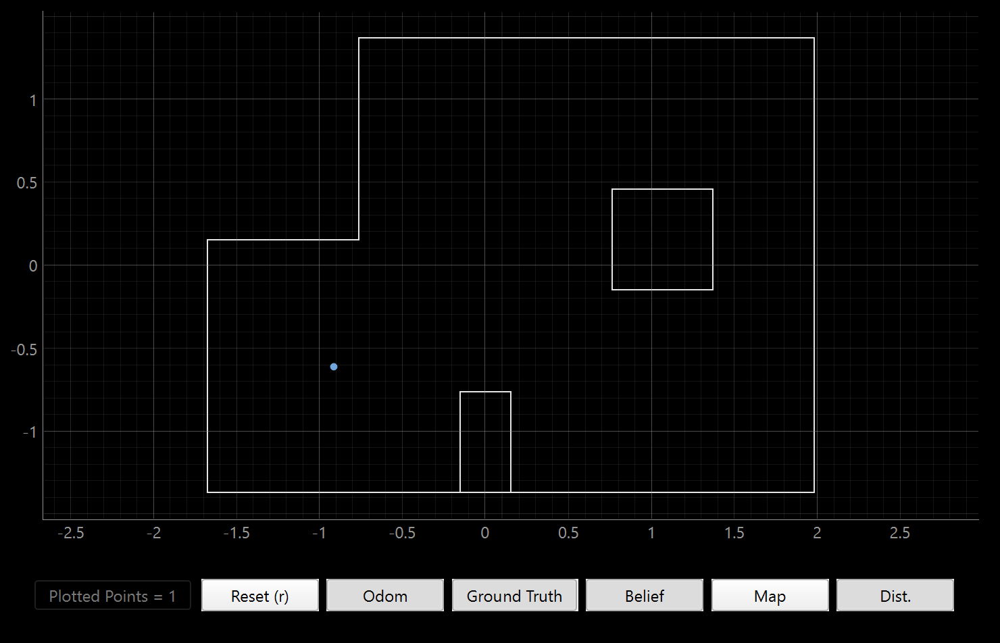
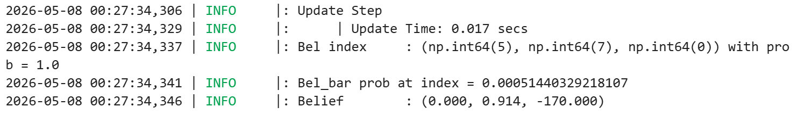
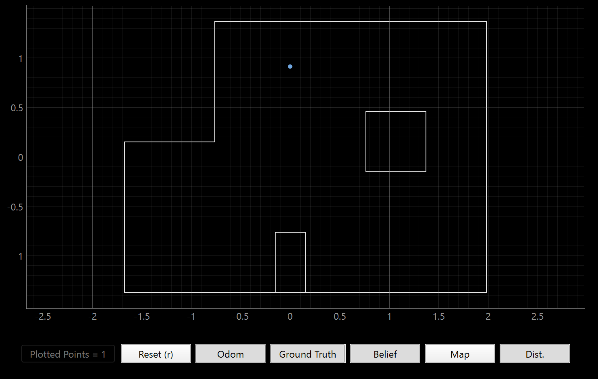

# LAB 11 - MAE4190 FAST ROBOTS

This is lab 11 of fast robots. In this lab, our objective is perform localization with the Bayes filter on our actual robot, and observe the differences between simulation from lab 10 and a real world system.

### Lab Tasks

In order to match the observation loop in world.yaml of our base code and to ensure the accuracy of my localized pose, I made adjustments to my lab 9 code. I decreased the increment at which my robot rotates to take a tof sensor reading to 20, and accordingly increased the number of turns to 18.

I also changed the PID controls such that my robot spins in a counterclockwise direction.

1. Testing Bayes filter in simulator



Testing the localization in the sim, the plot shows odometry in red, ground truth in green and belief in blue. The odometry is visibly quite off from what the path should be, due to the error that accumulates with each iteration. The ground truth and the belief follow each other closely, showing that the Bayes filter working well in simulation.

2. Running Bayes filter on our car in a real map

Unfortunately due to the motion noise of our robots, running the prediction step would not help us significantly. Hence, we will be implementing only the update function. I reused some code from lab 9 to implement the perform_observation_loop response, allowing the robot to turn 360 degrees in 20 degree increments for tof readings:

```python
    def perform_observation_loop(self, rot_vel=120):
        """Perform the observation loop behavior on the real robot, where the robot does  
        a 360 degree turn in place while collecting equidistant (in the angular space) sensor
        readings, with the first sensor reading taken at the robot's current heading. 
        The number of sensor readings depends on "observations_count"(=18) defined in world.yaml.
        
        Keyword arguments:
            rot_vel -- (Optional) Angular Velocity for loop (degrees/second)
                        Do not remove this parameter from the function definition, even if you don't use it.
        Returns:
            sensor_ranges   -- A column numpy array of the range values (meters)
            sensor_bearings -- A column numpy array of the bearings at which the sensor readings were taken (degrees)
                               The bearing values are not used in the Localization module, so you may return a empty numpy array
        """
        import asyncio
        time_array = []
        dist_array = []
        yaw_array = []

        def notifyBle(uuid, data):
            data = data.decode()
            parts = data.split(",")
        
            time_array.append(float(parts[0]))
            dist_array.append(float(parts[1]))
            yaw_array.append(float(parts[2]))
        
        self.ble.start_notify(ble.uuid['RX_STRING'], notifyBle)
        asyncio.run(asyncio.sleep(5))
        
        self.ble.send_command(CMD.START_SPIN, "1|0|0.0001")
        #Kp|Kd|Ki
        asyncio.run(asyncio.sleep(240))
        
        self.ble.send_command(CMD.STOP_SPIN, "")
        
        self.ble.send_command(CMD.SEND_SPIN_DATA, "")
        asyncio.run(asyncio.sleep(60))
        
        self.ble.stop_notify(ble.uuid['RX_STRING'])

        sensor_ranges = np.array(dist_array[:18])[np.newaxis].T / 1000
        sensor_bearings = np.array(yaw_array[:18])[np.newaxis].T

        return sensor_ranges, sensor_bearings
```

I used the shortcut asyncio function, but have not observed any problems with the code running.

My initial runs proved that my PID values needed adjustment. The yaw adjustments were too aggressive and that lead to the car drifting quite far away from the actual location. After experimenting, I ended up with Kp = 0.5, Kd = 0, and Ki = 0 for the most consistent on-axis turns.

### (5 ft,3 ft, 0 deg)




For this location, the localized pose isn't very close to the ground truth. Both the x and y coordinates are off by a foot or so. This is most likely due to my car not spinning perfectly in the same spot. The position is also tricky to localize as the left and bottom sides of the robot are not enclosed, and it only has two walls and a corner of an obstacle to work with. The TOF sensor would be reading distance values that are much farther away and potentially out of range, hence being less accurate. The orientation is mostly correct, and remains consistent across multiple trials.

### (5 ft,-3 ft, 0 deg)




Again, the x and y coordinates of the localized pose are both about a foot off from the ground truth. The pose is however pretty accurate to the final location my car ended up at after drifting during its turns, so the discrepancy is probably largely attributable to my car's movement:



The orientation is consistent. This corner is also not the best for localization, as there are open areas that could give inaccurate distance readings.

### (-3 ft ,-2 ft ,0 deg)




Now the localization gets better. Both the x and y coordinates are pretty much spot on, with the orientation angle a little off. This location is possibly giving very good results because it is mostly enclosed on all four sides. The car also did not drift as much, allowing the pose to be placed pretty accurately in the center of the square.

### (0 ft,3 ft, 0 deg)




This localization was also very accurate. The orientation was quite strange though. This may be due to a problem with my initialization in original yaw, or how my DMP fuses the absolute angular sensor readings from the IMU. 

This supposedly should have similar accuracies to the position of (5,3), as they have similar levels of exposure to obstacles and walls, but this worked much better. I think it is most likely due to the inconsistent amounts of drifting that my car does when executing the full spin. It could also be due to (0,3) not having a long, empty hallway on one side and having some closer indicator of distance by the little partition wall.


### Overall Observations
Unfortunately the Bayes filter does not perform as well as the simulation when used on a real system in a physical map. Our car has a lot of noise in both its motion and sensor readings, giving it difficulties in good localization. Moreover, I was using the long distance mode on my TOF sensor. While it gives more range for farther readings, useful for open spaces, using the short distance mode could give higher resolution readings for a more accurate guess as to where the car is.

