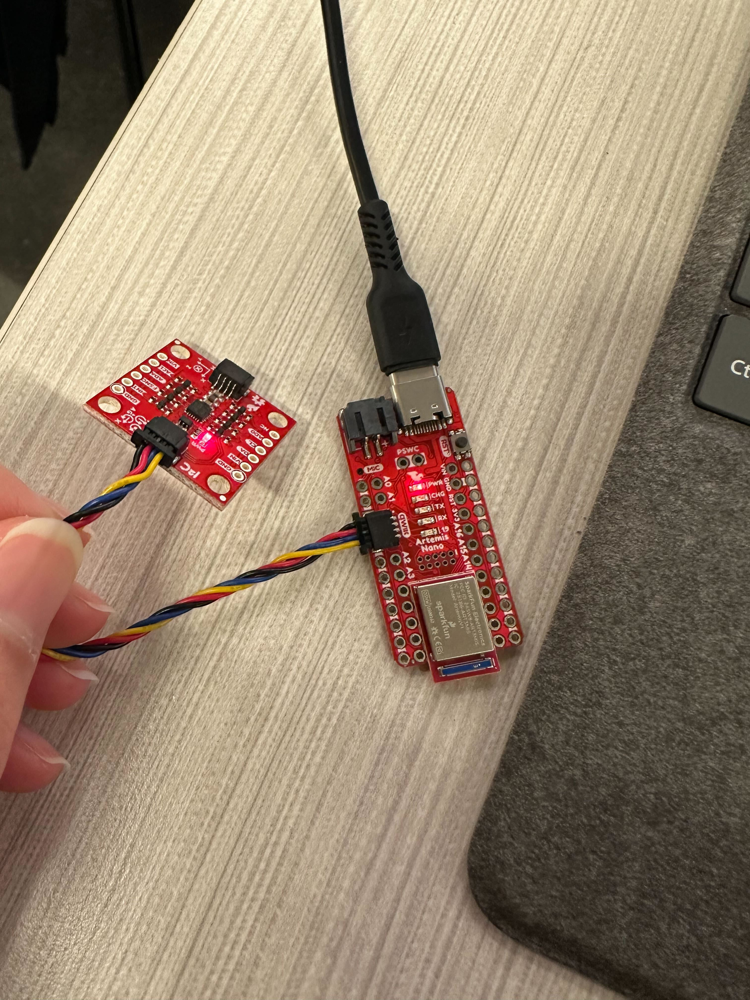
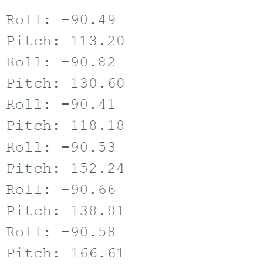
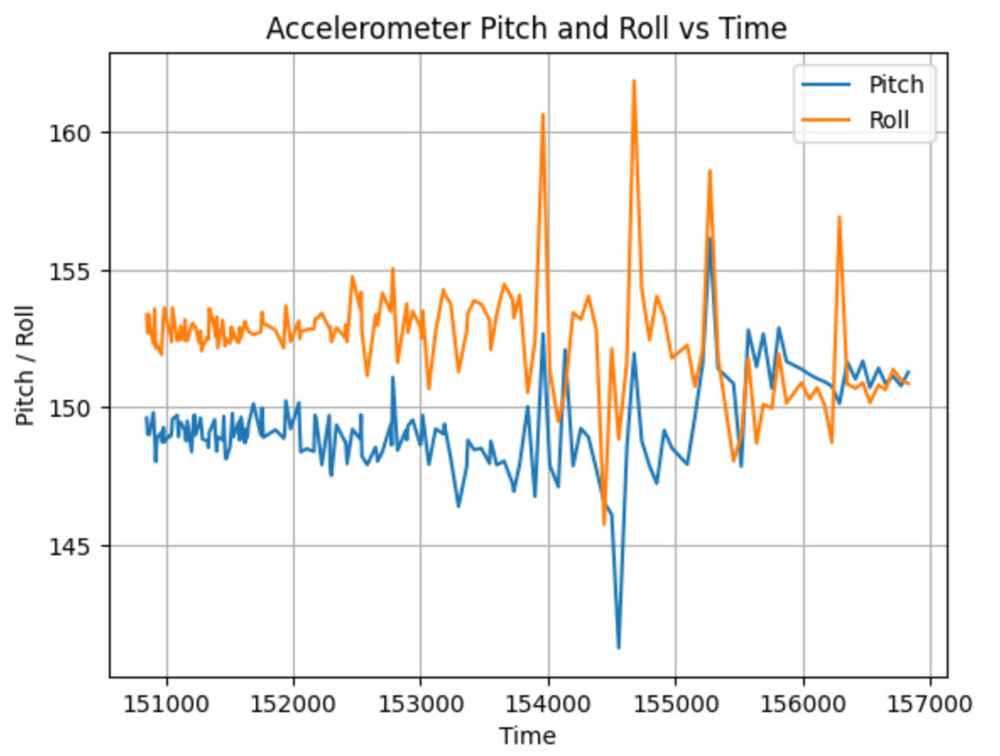
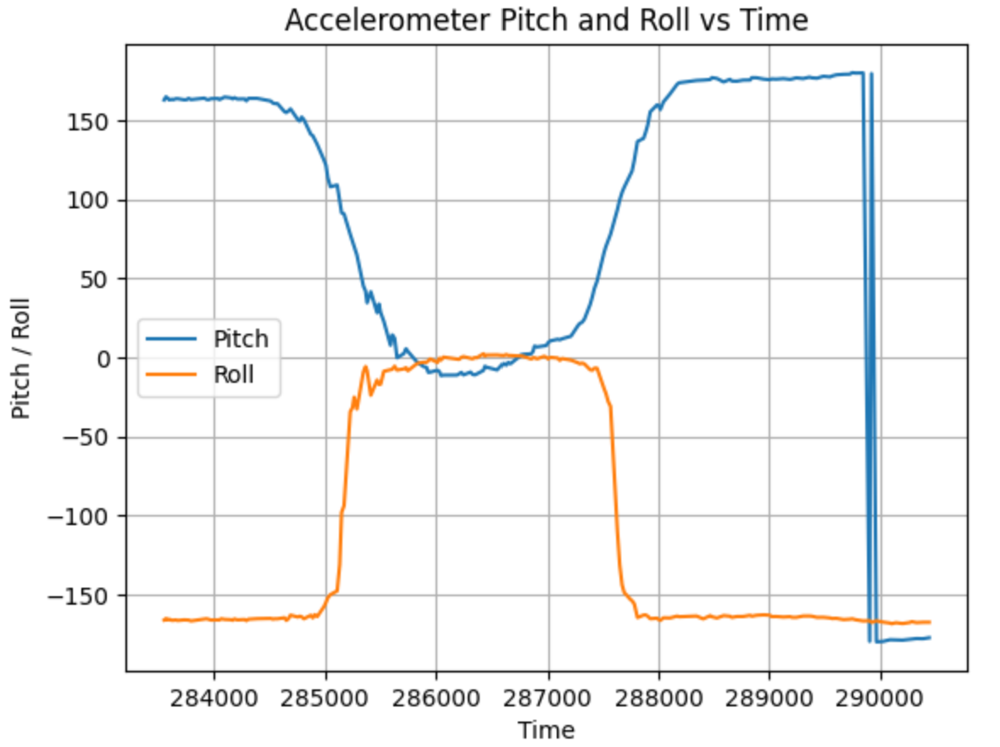
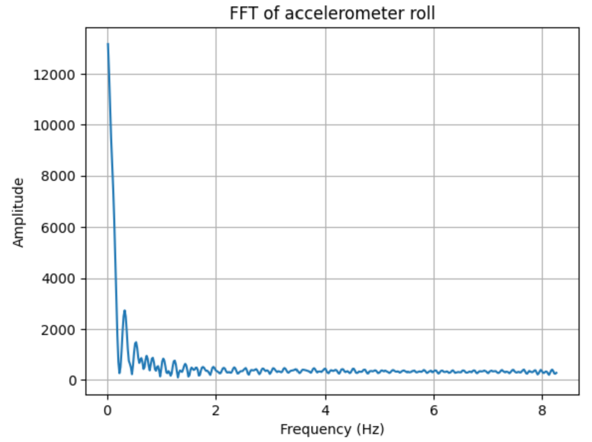
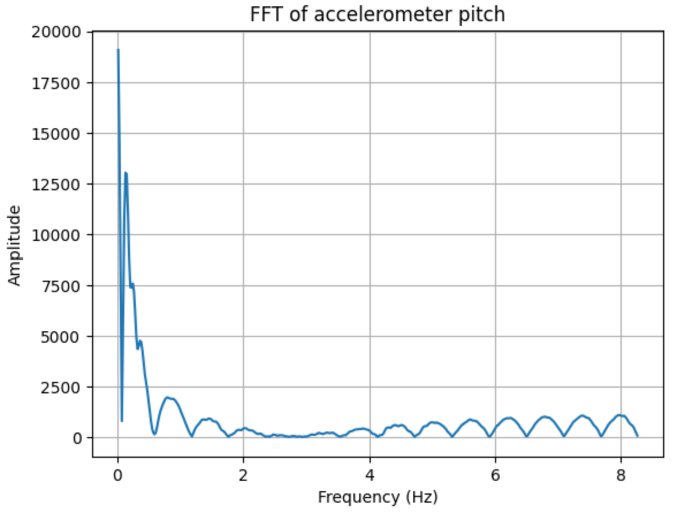
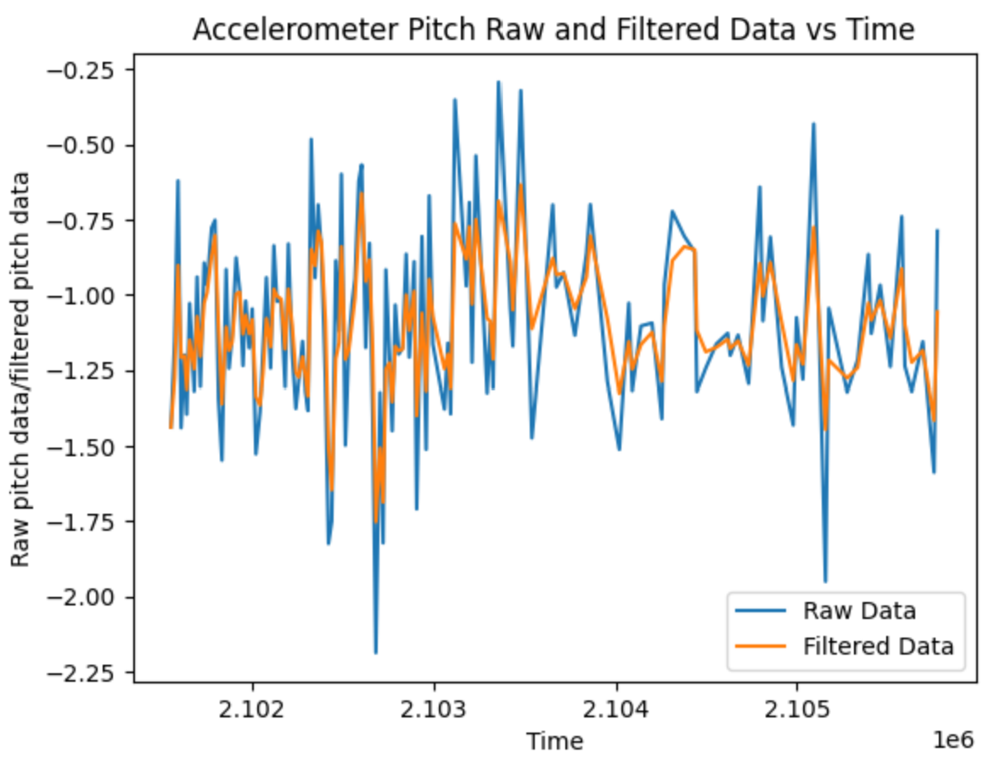
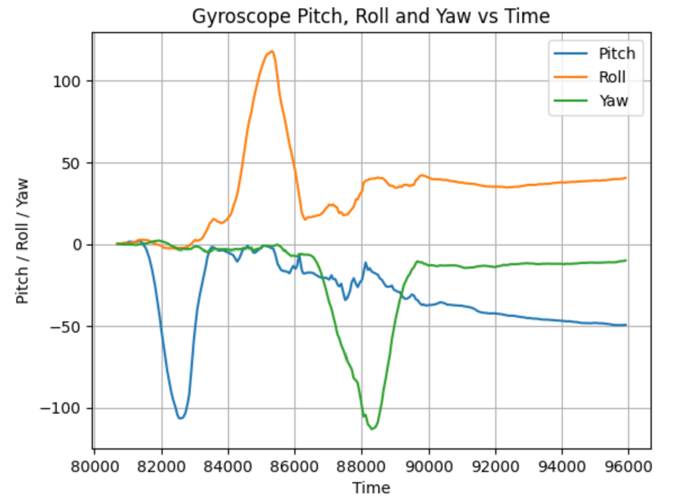
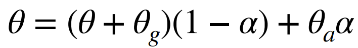

# LAB 2 - MAE4190 FAST ROBOTS

## Lab Tasks

### Set up the IMU


You can see the numbers changing as I change the orientation of the IMU.
The acceleration values change according to the orientation of the IMU, while the gyroscope data changes based on the motion of me moving the IMU (angular velocity).

The IMU offers two I2C addresses, corresponding to the two different pins. Two different AD0 configurations are needed to distinguish between the higher and lower addresses while connected to the same I2C bus. That is the purpose of the AD0_VAL. The default is 1, and when the ADR jumper is closed the value becomes 0.

### Accelerometer

The accelerometer measures linear acceleration in all directions. Hence, from its x, y and z outputs we are able to determine the orientation angles of the IMU. However, since it is affected by gravity, the accelerometer cannot help us find rotation in yaw as the acceleration would remain around 9.81 m/s^2, regardless of which way we rotate it parallel to the ground.

I converted the data from the accelerometer to roll and pitch using the equations from lecture:
```C++
case ACC_PITCHROLL: {

          for (int tindex = 0; tindex < 3000; tindex++){
            time_doc[tindex] = millis();
            
            myICM.getAGMT();
            float ax = myICM.accX();
            float ay = myICM.accY();
            float az = myICM.accZ();

            float roll = atan2(ay, az) * 180/M_PI;
            float pitch = atan2(ax, az) * 180/M_PI;

```

This is the output of the pitch and roll when the IMU is at {-90, 0, 90}.


The roll of the accelerometer is fairly accurate, I set it squarely against the table and the reading is consistently around -90 degrees. Small adjustments are also pretty stable. However, the pitch fluctuates a lot, potentially due to the vibrations along my table. It also seems to have a slight offset, outputting values up to 166 degrees when it should be at 90.

In order to broadcast the data over to python (gyroscope code included, but they are similar):

```python
timestamp = []
acc_pitch = []
acc_roll = []
gyr_pitch = []
gyr_roll =[]
gyr_yaw = []

def notifyBle(uuid, data):
    data = data.decode().strip()
    parts = data.split(",")
    
    timestamp.append(float(parts[0]))
    acc_pitch.append(float(parts[1]))
    acc_roll.append(float(parts[2]))
    gyr_pitch.append(float(parts[3]))
    gyr_roll.append(float(parts[4]))
    gyr_yaw.append(float(parts[5]))
```

Graphing the accelerometer data:

```python
plt.plot(timestamp, acc_pitch[0:3000], label="Pitch")
plt.plot(timestamp, acc_roll[0:3000], label="Roll")
        
plt.xlabel("Time")
plt.ylabel("Pitch / Roll")
plt.title("Accelerometer Pitch and Roll vs Time")
plt.legend()
plt.grid(True)
        
plt.show()
```

Here is the jupyter graph that generates with the data obtained with an arbitrary orientation. As the graph shows, the data is quite noisy.


Here is a graph that shows the accelerometer data while I'm flipping the IMU around. The sudden spike at the end is due to me setting the IMU down on the table.


In order to filter out some of the noise, we want to analyze the frequencies at which the noise occurs at with a Fourier Transform.

For the accelerometer roll Fourier Transform:
```python
dt = np.mean(np.diff(timestamp)) / 1000

N = len(acc_roll)
fft_roll = np.fft.fft(acc_roll)
freqs_roll = np.fft.fftfreq(N, d=dt)

pos_freq = freqs_roll > 0

freqs_roll = freqs_roll[pos_freq]
fft_mag = np.abs(fft_roll[pos_freq])

plt.plot(freqs_roll, fft_mag)
plt.xlabel("Frequency (Hz)")
plt.ylabel("Amplitude")
plt.title("FFT of accelerometer roll")
plt.grid(True)
plt.show()
```



For the accelerometer pitch Fourier Transform:
Code is very similar, except with the pitch data from the accelerometer instead.



Looking at the FFT graphs, the accelerometer tends to have higher magnitudes in lower frequencies, which is expected as any motion induced by us would be a much slower change as compared to ambient noise or vibrations in the environment. Since the pitch shows significant peaks after around 3.5Hz, that will be my benchmark for the low pass filter. In order to calculate the alpha:

```python
low_pass_freq = 3.5
alpha = (2*np.pi*low_pass_freq*dt) / (1 + 2*np.pi*low_pass_freq*dt)
low_pass = np.zeros_like(acc_roll)

low_pass[0] = acc_roll[0]
for i in range(1, len(acc_roll)):
    low_pass[i] = alpha*acc_roll[i] + (1-alpha)*low_pass[i-1]

plt.plot(timestamp, acc_roll, label="Raw Data")
plt.plot(timestamp, low_pass, label="Filtered Data")
plt.title("Accelerometer Roll Raw and Filtered Data vs Time")
plt.xlabel("Time")
plt.ylabel("Raw roll data/filtered roll data")
plt.legend()
plt.show()
```




The comparison between the raw and unfiltered data are shown above. The spikes and sudden fluctuations for both roll and pitch data are mellowed out, their magnitudes decreased. The changes seems more obvious in the pitch data, which makes sense since while the roll data has a small amount of noise at all frequencies, the pitch data has significant noise at frequencies above 3.5Hz. I therefore chose the frequency threshold to be low enough to filter out most of the contributing noise, but high enough that I do not lose other useful data.

### Gyroscope

The gyroscope provides another form of data captured by the IMU. It measures the rate of angular change, and as a result it is able to provide us with data of all roll, pitch and yaw. The gyroscope and accelerometer on the IMU complement each other in the form of sensor fusion, giving us more reliable and comprehensive results. While the gyroscope gives us the yaw orientation which the accelerometer cannot measure, the accelerometer is less prone to drift, which the gyroscope experiences due to its nature of integrating over small intervals in time with dead reckoning.

In order to incorporate the gyroscope readings as well, the Arduino command is now:

```C++
case PITCHROLLYAW: {

    for (int tindex = 0; tindex < 3000; tindex++){
        time_doc[tindex] = millis();
            
        myICM.getAGMT();
        float ax = myICM.accX();
        float ay = myICM.accY();
        float az = myICM.accZ();
        float gx = myICM.gyrX();
        float gy = myICM.gyrY();
        float gz = myICM.gyrZ();

        float acc_roll = atan2(ay, az) * 180/M_PI;
        float acc_pitch = atan2(ax, az) * 180/M_PI;
            
        if (tindex == 0){
            dt = 0;
        }
        else {
            dt = (time_doc[tindex] - time_doc[tindex-1])/1000.;
        }
            
        gyr_roll += gx * dt;
        gyr_pitch += gy * dt;
        gyr_yaw += gz * dt;

        SERIAL_PORT.print(dt);
        SERIAL_PORT.print("    Acc_Roll: ");
        SERIAL_PORT.print(acc_roll);
        SERIAL_PORT.print(", Acc_Pitch: ");
        SERIAL_PORT.print(acc_pitch);
        SERIAL_PORT.print(", Gyr_Roll: ");
        SERIAL_PORT.print(gyr_roll);
        SERIAL_PORT.print(", Gyr_Pitch: ");
        SERIAL_PORT.print(gyr_pitch);
        SERIAL_PORT.print(", Gyr_Yaw: ");
        SERIAL_PORT.println(gyr_yaw);
            
        tx_estring_value.clear();
        tx_estring_value.append((int)time_doc[tindex]);
        tx_estring_value.append(",");
        tx_estring_value.append(acc_roll);
        tx_estring_value.append(",");
        tx_estring_value.append(acc_pitch);
        tx_estring_value.append(",");
        tx_estring_value.append(gyr_roll);
        tx_estring_value.append(",");
        tx_estring_value.append(gyr_pitch);
        tx_estring_value.append(",");
        tx_estring_value.append(gyr_yaw);
        tx_characteristic_string.writeValue(tx_estring_value.c_str());

    }


          break;

}
```

The time intervals are now calculated by storing them in an array (time_doc). The serial print of dt ensures that each interval is calculated correctly and the gyroscope readings convert and compound as expected.
The following graph shows the results as I am rotating the IMU about 90 degrees (a little inaccurate) in each of the axes of rotation:



As compared to the accelerometer data, the gyroscope readings have a lot less noise, having relatively smooth plots even comparing with the data with the low pass filter. It is also able to detect changes in yaw. However, there is a visible effect of the drift, as the graph shows a slight deviation towards the end even as the IMU is placed still. This is also reflected in the printed data, as it gradually increments despite no movement from the IMU:


To improve the accuracy and stability of the measured angles, the multiple sensors on the IMU allows us to utilize sensor fusion to combine the data from the accelerometer and the gyroscope. To do so, we need to apply a complementary filter.



We can use this to estimate more accurate and reliable data for roll and pitch, mitigating the effects of noise on the accelerometer and drift on the gyroscope, but unfortunately we cannot do this for yaw as we only have the gyroscope data.


Use a complementary filter to compute an estimate of pitch and roll which is both accurate and stable. Demonstrate its working range and accuracy, and that it is not susceptible to drift or quick vibrations.

### Sample Data
Speed of sampling discussion
Demonstrate collected and stored time-stamped IMU data in arrays
Demonstrate 5s of IMU data sent over Bluetooth
### Record a Stunt
Include a video (or some videos) of you playing with the car and discuss your observations

(Side note to self) I accidentally uploaded some files that were way too big and the way to fix that is to get the log of commits and dial back to the commit before the large file