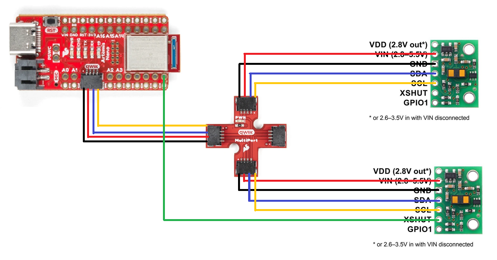
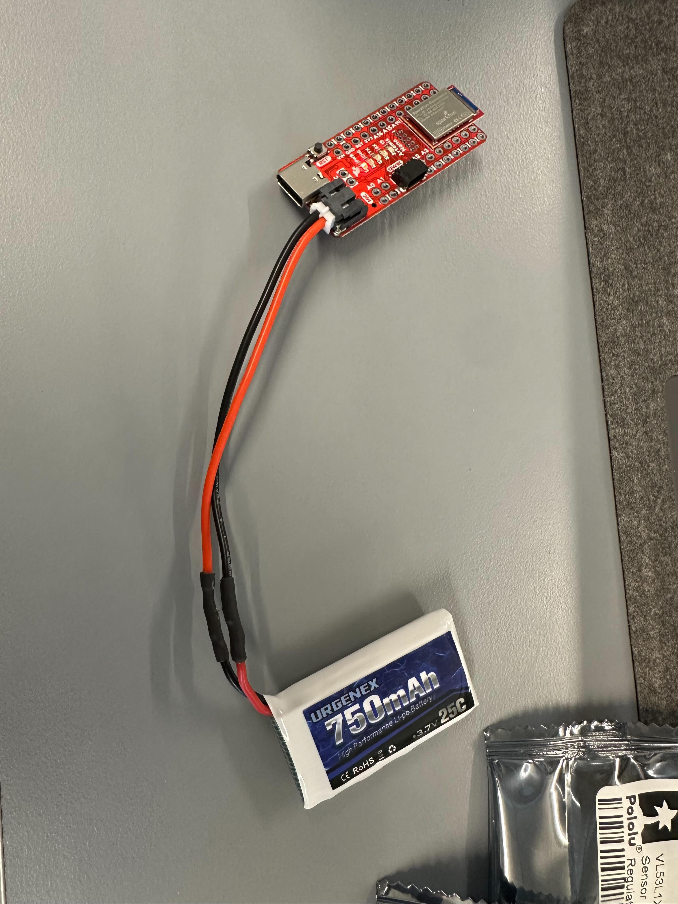
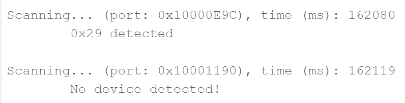

# LAB 3 - MAE4190 FAST ROBOTS

Welcome to lab 3 of fast robots! In this lab we install and set up the Time-of-Flight sensors that our cars are going to use to detect distance.

## Prelab

Since we will be using two ToF sensors simultaneously, and the two sensors currently share the same address, we have to either change the address programmatically or use their shutdown pins to enable and disable them in order to address them individually. I will most likely use the programming approach as repeated powering up and shutting down the sensor may slow them down while running the robot.

I soldered one of the ToF sensor's XSHUT pin to the Artemis' pin 8, then shut down the sensor to reassign the address on start up. Now the two sensors would have two independent addresses and can operate simultaneously.

Note the I2C sensor address
Briefly discuss the approach to using 2 ToF sensors
Briefly discuss placement of sensors on robot and scenarios where you will miss obstacles
Sketch of wiring diagram (with brief explanation if you want)

Given their range and angular sensitivity, think about where you will place them on your robot to best detect obstacles in future labs. Discuss scenarios where your robot will miss obstacles.

Think about which connections you want to be detachable and which can be permanent
Think about which side of the sensors you mount the wires from.
Think about the placement of each sensor in the chassis and how long the wires have to be.

## Lab Tasks

We need to power the Artemis with a battery instead of connecting to a power source with a cable, hence a JST connector is soldered to a 750mAh battery pack to plug into the board.

This is the configuration of the sensors and the Artemis board after my soldering connections.

By only connecting one ToF sensor for now, we use the Example05_wire_I2C code to print the address of the sensor.

The address is shown to be 0x29. This aligns with what we expect as the default I2C address is 0x52, as stated in the sensor datasheet, but because Arduino is using 7-bit addressing, and the last bit is used for read/write indication, hence it is shifted right toe show 0x29 instead.

proved that arduino works just by ble and battery

(Picture of your ToF sensor connected to your QWIIC breakout board
Screenshot of Artemis scanning for I2C device (and discussion on I2C address))
Discussion and pictures of sensor data with chosen mode

6. The ToF sensor has three modes (Short, Medium, and Long) that optimize the ranging performance given the maximum expected range. Discuss the pros/cons of each mode, and think about which one could work on the final robot. (Note: medium mode is only available with the Polulu VL53L1X Library).

<pre> .setDistanceModeShort(); //1.3m .setDistanceModeMedium(); //3m .setDistanceModeLong(); //4m, Default </pre>

The shorter the range for each mode, the faster the robot can receive data about the environment, and the more accurate the data would be.

2 ToF sensors and the IMU: Discussion and screenshot/video of sensors working in parallel
Tof sensor speed: Discussion on speed and limiting factor; include code snippet of how you do this
Time v Distance: Include graph of data sent over bluetooth (2 sensors)
Time v Angle: Include graph of data sent over bluetooth
(5000) Discussion on infrared transmission based sensors
(5000) Sensitivity of sensors to colors and textures