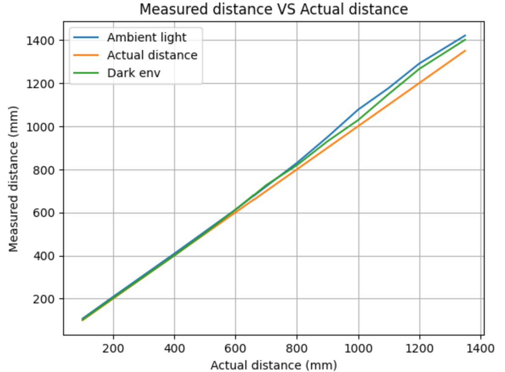
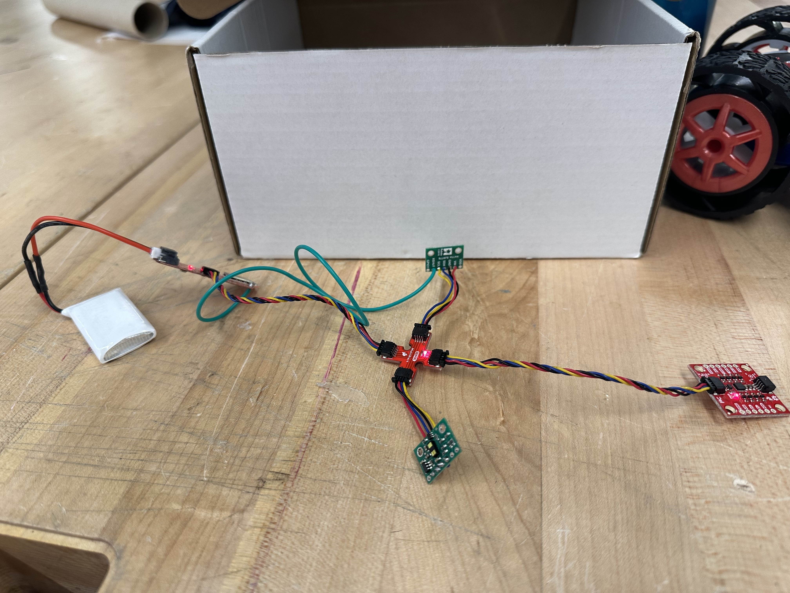
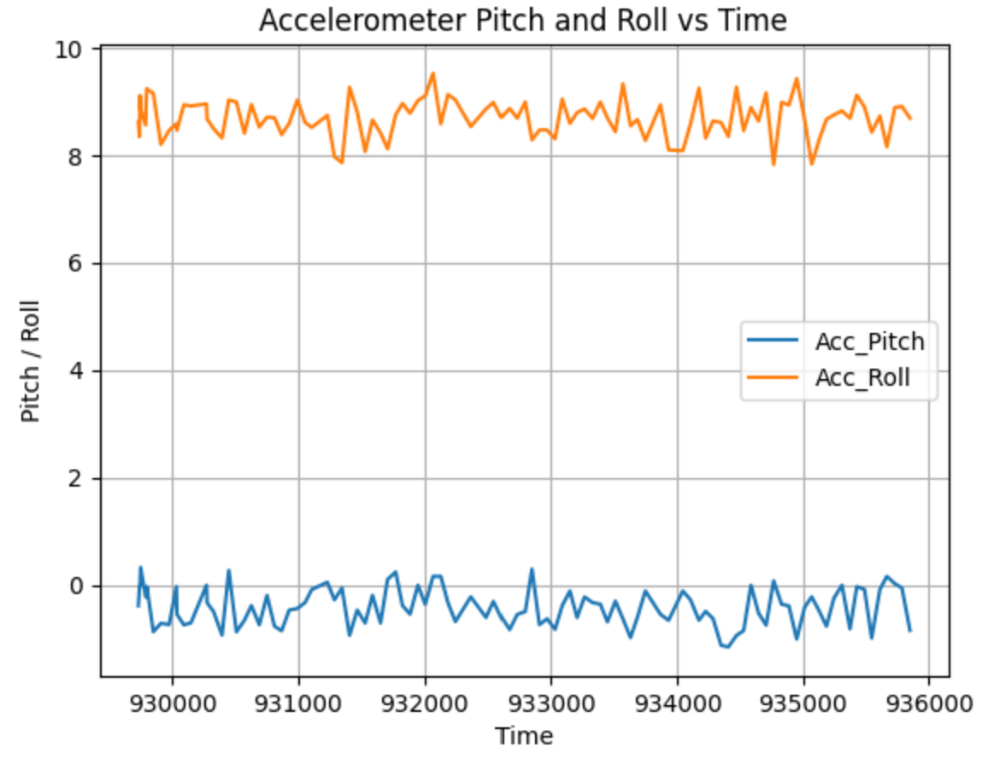
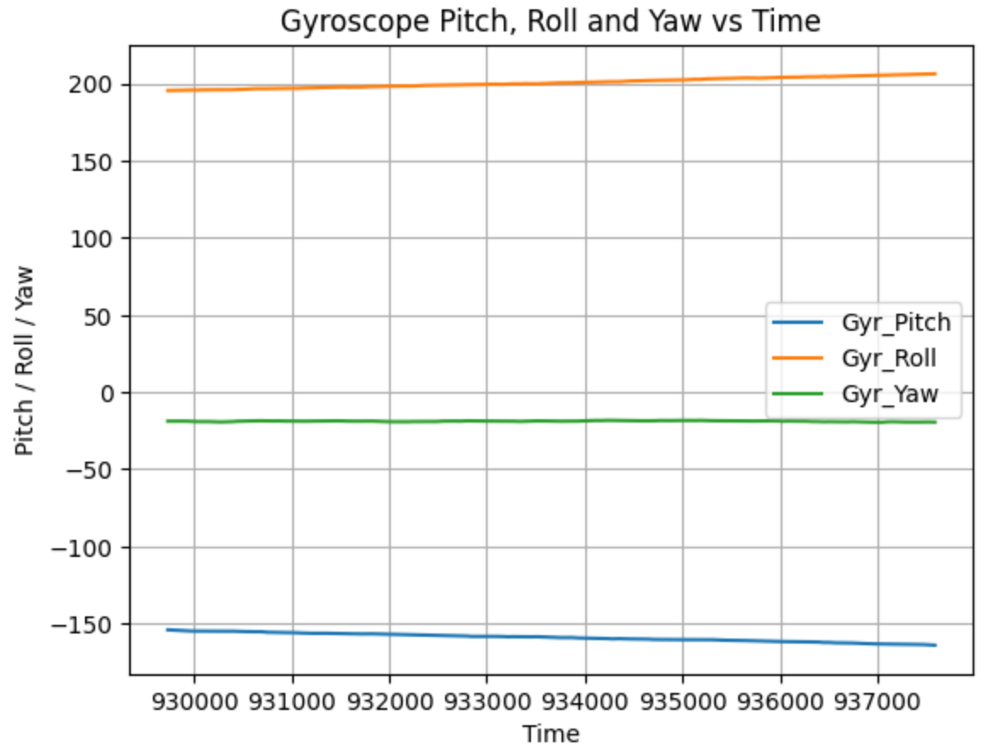
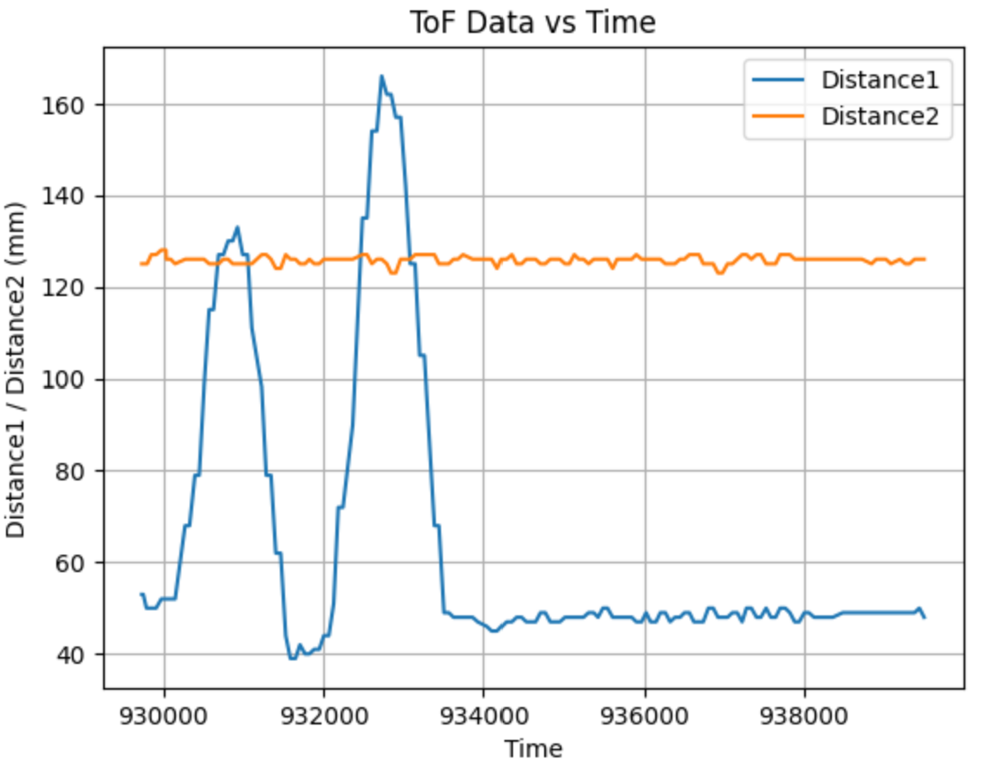

# LAB 3 - MAE4190 FAST ROBOTS

Welcome to lab 3 of fast robots! In this lab we install and set up the Time-of-Flight sensors that our cars are going to use to detect distance.

## Prelab

Since we will be using two ToF sensors simultaneously, and the two sensors currently share the same address, we have to either change the address programmatically or use their shutdown pins to enable and disable them in order to address them individually. I will most likely use the programming approach as repeated powering up and shutting down the sensor may slow them down while running the robot.

I soldered one of the ToF sensor's XSHUT pin to the Artemis' pin 8, then shut down the sensor to reassign the address on start up. Now the two sensors would have two independent addresses and can operate simultaneously. Their addresses will be (0x29) and (0x30) respectively. The following is the code with which I will use to change the address every time during start up:

```C++
  //shutdown
  pinMode(XSHUT, OUTPUT);
  digitalWrite(XSHUT, LOW);

  //readdress online sensor
  distanceSensor1.begin();
  distanceSensor1.setI2CAddress(0x30);

  if (distanceSensor1.begin() != 0) //Begin returns 0 on a good init
  {
    Serial.println("Sensor 1 failed to begin. Please check wiring. Freezing...");
  }
  else{
    Serial.println("Sensor 1 online!");
  }

  //turn offline sensor back on
  digitalWrite(XSHUT, HIGH);
  distanceSensor2.begin();

  if (distanceSensor2.begin() != 0) //Begin returns 0 on a good init
  {
    Serial.println("Sensor 2 failed to begin. Please check wiring. Freezing...");
  }
  else{
    Serial.println("Sensor 2 online!");
  }
```

Since we only have two ToF sensors, I will place them on the front and back of the car. this will ensure that no matter which way the car flips and drives, it will always be able to map its surroundings in its path. I will be missing obstacles on the sides, but with the speed at which the car turns, unless I am drifting for a long period of time, I doubt the sensors would respond fast enough for the car to react to any obstacles on its sides.

This is my wiring diagram:


The two ToF sensors are placed directly opposite to each other to make the placement on the car more convenient. The wires will probably have to be elongated to reach the two ends of the car, though. Considering the housing for the battery on the chassis, there will probably have to be one sensor with a longer connecting wire than the other.

## Lab Tasks

We need to power the Artemis with a battery instead of connecting to a power source with a cable, hence a JST connector is soldered to a 750mAh battery pack to plug into the board.


This is the configuration of the sensors and the Artemis board after my soldering connections.


By only connecting one ToF sensor for now, we use the Example05_wire_I2C code to print the address of the sensor.


The address is shown to be 0x29. This aligns with what we expect as the default I2C address is 0x52, as stated in the sensor datasheet, but because Arduino is using 7-bit addressing, and the last bit is used for read/write indication, hence it is shifted right to show 0x29 instead.

The ToF sensors have three different modes, Short, Medium and Long. According to the sensor datasheet, the max. distance in dark (cm) and max. distance under strong light (cm) for the three modes are respectively:

Short: 136 / 135

Medium: 290 / 76

Long: 360 / 73

The shorter the range for each mode, the faster the robot can receive data about the environment, and the more accurate the data would be. However, the longer ranges give us a better overview of observable obstacles in the surroundings. I think for now I will be using the Short mode, as for our car, it would be more important for quicker detection speeds as well as being reliable under indoor lighting. As seen from the comparisons, both medium and long are significantly impacted by ambient light. The range of around 1.3m is also most likely enough for our car in general.

In order to test the accuracy of our ToF sensor in our chosen mode, I made this set up to compare the actual distance VS the measured distance:


I took the average of the distance measured over 100 data points and plotted against the actual distance across the written range of the ToF sensor.

The following graph shows the data I collected for the ToF sensor under bright ambient lighting as well as in a darker environment. Both graphs are fairly linear, and follows the actual distance quite closely while the wall is close, but the error increases gradually as the distance is farther away. The distance taken for the sensor in darker lighting follows the actual distance a lot more closely though. There may be some deviations due to alignment and human errors.



I also tried to measure beyond the given range, and it does go beyond a little to almost 1500+ mm, but the inaccuracies increase significantly, so the data would not be reliable. The speed at which the sensor can send data is limited by the ranging time, as the sensor needs to wait for the returning infrared ray. In order to obtain more useful data, while sending the timestamps with every loop iteration, I added the .checkforDataReady() function to each loop, allowing the data to only be sent when updated.

```C++
if (distanceSensor1.checkForDataReady() || distanceSensor2.checkForDataReady()) {
      read_data();
```

To make sure the IMU and the two ToF sensors can work in conjunction, I edited my previous code to initiate and use all of them simultaneously.

```C++
        case SEND_DISTANCE:

          for (int tindex = 0; tindex < 1000; tindex++){
            time_doc[tindex] = millis();

            //ToF data

            //IMU data
            myICM.getAGMT();
            float ax = myICM.accX();
            float ay = myICM.accY();
            float az = myICM.accZ();
            float gx = myICM.gyrX();
            float gy = myICM.gyrY();
            float gz = myICM.gyrZ();

            float acc_roll = atan2(ay, az) * 180/M_PI;
            float acc_pitch = atan2(ax, az) * 180/M_PI;
            
            acc_roll_doc[tindex] = acc_roll;
            acc_pitch_doc[tindex] = acc_pitch;

            if (tindex == 0){
              dt = 0;
            }
            else {
              dt = (time_doc[tindex] - time_doc[tindex-1])/1000.;
            }

            float gx_diff = gx * dt;
            float gy_diff = gy * dt;
            
            gyr_roll += gx_diff;
            gyr_pitch += gy_diff;
            gyr_yaw += gz * dt;

            gyr_roll_doc[tindex] = gyr_roll;
            gyr_pitch_doc[tindex] = gyr_pitch;
            gyr_yaw_doc[tindex] = gyr_yaw;

            //send data
            tx_estring_value.clear();
            tx_estring_value.append((int)time_doc[tindex]);
            tx_estring_value.append(",");
            tx_estring_value.append(acc_roll);
            tx_estring_value.append(",");
            tx_estring_value.append(acc_pitch);
            tx_estring_value.append(",");
            tx_estring_value.append(gyr_roll);
            tx_estring_value.append(",");
            tx_estring_value.append(gyr_pitch);
            tx_estring_value.append(",");
            tx_estring_value.append(gyr_yaw);
            tx_estring_value.append(",");
            tx_estring_value.append(gx_diff);
            tx_estring_value.append(",");
            tx_estring_value.append(gy_diff);
            tx_estring_value.append(",");
            tx_estring_value.append(distanceSensor1.getDistance());
            tx_estring_value.append(",");
            tx_estring_value.append(distanceSensor2.getDistance());
            distanceSensor1.clearInterrupt();
            distanceSensor2.clearInterrupt();
            tx_characteristic_string.writeValue(tx_estring_value.c_str());

            //Serial.println(tx_estring_value.c_str());
          
          }

            break;
```
My set up is as follows:



Here are the graphs of all of them working together against time



