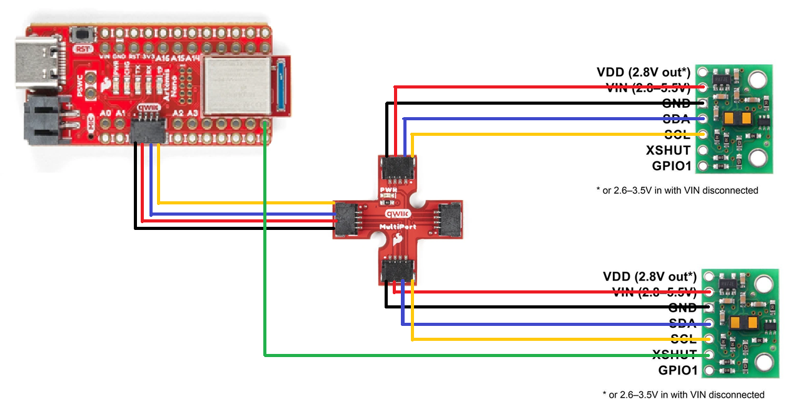
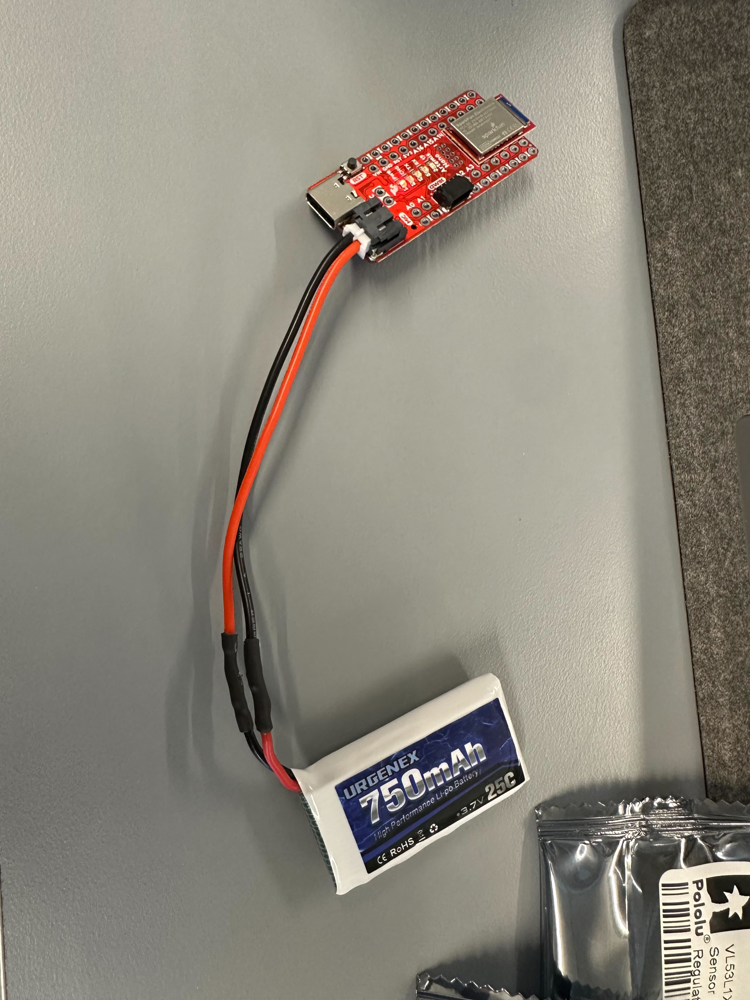
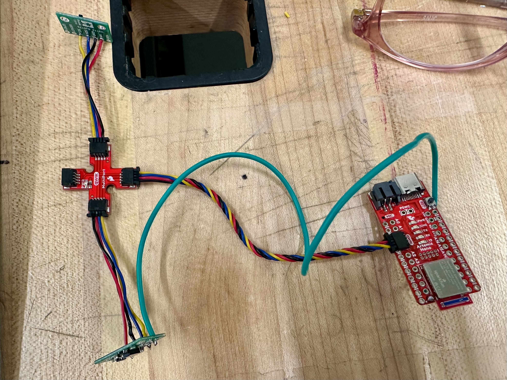
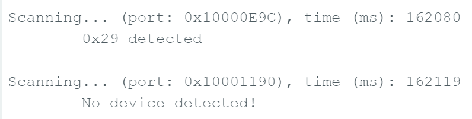

# LAB 3 - MAE4190 FAST ROBOTS

Welcome to lab 3 of fast robots! In this lab we install and set up the Time-of-Flight sensors that our cars are going to use to detect distance.

## Prelab

Since we will be using two ToF sensors simultaneously, and the two sensors currently share the same address, we have to either change the address programmatically or use their shutdown pins to enable and disable them in order to address them individually. I will most likely use the programming approach as repeated powering up and shutting down the sensor may slow them down while running the robot.

I soldered one of the ToF sensor's XSHUT pin to the Artemis' pin 8, then shut down the sensor to reassign the address on start up. Now the two sensors would have two independent addresses and can operate simultaneously. Their addresses will be (0x29) and (0x30) respectively. The following is the code with which I will use to change the address every time during start up:

```C++
  //shutdown
  pinMode(XSHUT, OUTPUT);
  digitalWrite(XSHUT, LOW);

  //readdress online sensor
  distanceSensor1.begin();
  distanceSensor1.setI2CAddress(0x30);

  if (distanceSensor1.begin() != 0) //Begin returns 0 on a good init
  {
    Serial.println("Sensor 1 failed to begin. Please check wiring. Freezing...");
  }
  else{
    Serial.println("Sensor 1 online!");
  }

  //turn offline sensor back on
  digitalWrite(XSHUT, HIGH);
  distanceSensor2.begin();

  if (distanceSensor2.begin() != 0) //Begin returns 0 on a good init
  {
    Serial.println("Sensor 2 failed to begin. Please check wiring. Freezing...");
  }
  else{
    Serial.println("Sensor 2 online!");
  }
```

Since we only have two ToF sensors, I will place them on the front and back of the car. this will ensure that no matter which way the car flips and drives, it will always be able to map its surroundings in its path. I will be missing obstacles on the sides, but with the speed at which the car turns, unless I am drifting for a long period of time, I doubt the sensors would respond fast enough for the car to react to any obstacles on its sides.

This is my wiring diagram:



The two ToF sensors are placed directly opposite to each other to make the placement on the car more convenient. The wires will probably have to be elongated to reach the two ends of the car, though. Considering the housing for the battery on the chassis, there will probably have to be one sensor with a longer connecting wire than the other.

## Lab Tasks

We need to power the Artemis with a battery instead of connecting to a power source with a cable, hence a JST connector is soldered to a 750mAh battery pack to plug into the board.



This is the configuration of the sensors and the Artemis board after my soldering connections.



By only connecting one ToF sensor for now, we use the Example05_wire_I2C code to print the address of the sensor.



The address is shown to be 0x29. This aligns with what we expect as the default I2C address is 0x52, as stated in the sensor datasheet, but because Arduino is using 7-bit addressing, and the last bit is used for read/write indication, hence it is shifted right to show 0x29 instead.

The ToF sensors have three different modes, Short, Medium and Long. According to the sensor datasheet, the max. distance in dark (cm) and max. distance under strong light (cm) for the three modes are respectively:

Short: 136 / 135

Medium: 290 / 76

Long: 360 / 73

The shorter the range for each mode, the faster the robot can receive data about the environment, and the more accurate the data would be. However, the longer ranges give us a better overview of observable obstacles in the surroundings. I think for now I will be using the Short mode, as for our car, it would be more important for quicker detection speeds as well as being reliable under indoor lighting. As seen from the comparisons, both medium and long are significantly impacted by ambient light. The range of around 1.3m is also most likely enough for our car in general.


Document your ToF sensor range
accuracy (measured VS actual) --> expect a linear graph if accurate
repeatability (diff lighting?)
and ranging time (take note of timestamps)

proved that arduino works just by ble and battery

Discussion and pictures of sensor data with chosen mode

2 ToF sensors and the IMU: Discussion and screenshot/video of sensors working in parallel
Tof sensor speed: Discussion on speed and limiting factor; include code snippet of how you do this
Time v Distance: Include graph of data sent over bluetooth (2 sensors)
Time v Angle: Include graph of data sent over bluetooth