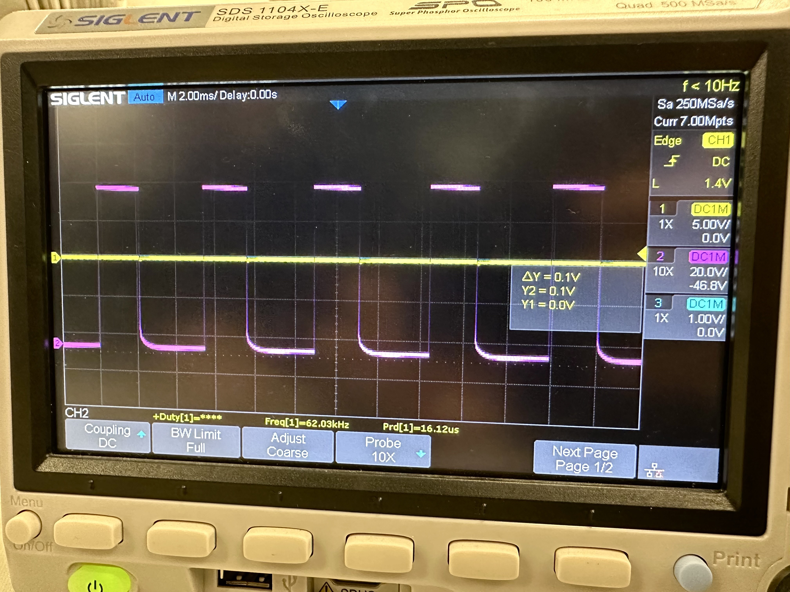
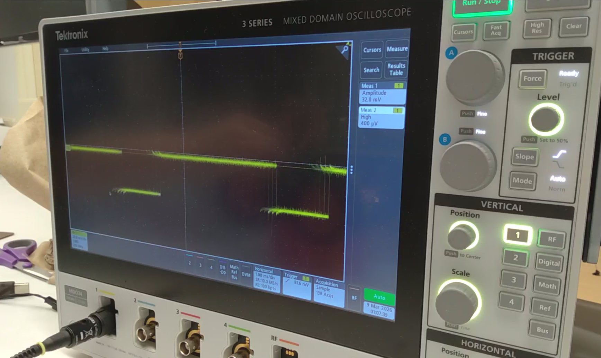

# LAB 4 - MAE4190 FAST ROBOTS

Welcome to lab 4 of fast robots! In this lab we change from manual to open loop control of the car with the Artemis and two dual motor drivers.

## Prelab

To begin connecting all the components of the car, we solder the motor drivers, Artemis (along with the IMU and ToF sensors on the breakout board) and the 850 mAh battery together. 

Here is my wiring diagram:


For the motor drivers, I connected the signal wires to analog pins on the Artemis such that I am able to send PWM signals, one connected to A14 and A15, and the other to A2 and A3. They are connected on opposite sides of the Artemis board to avoid getting too clustered, as well as being more convenient to be placed side by side on the car eventually.

The Artemis and the motor drivers/motors receive power from two separate batteries. This is to ensure both components receive the appropriate amount of power, while ensuring that the function of the motors and the Artemis will not interfere with each other. If the motor draws a large amount of voltage, for example when it cannot overcome friction and stalls, the Artemis board should still be able to operate and send commands/data.

In terms of length of wires, ideally they should be as short as possible without causing strain to the connection points to reduce noise (I have overestimated some of the lengths for my soldering, but I will clean them up soon). An important point to note is that the 850mAh car battery must be detachable for charging, hence the power wires are soldered to the original connectors on the car instead of directly to the battery.

## Testing for PWM (Oscilloscope)

This was my output for the PWM signal with the motor driver before it was soldered onto the car, unfortunately I did not take a picture of the set up. According to the data sheet of the motor drivers, the range of voltage we can use is 2.7V-10.8V. The power supply was set to around 6.8 to have a safe margin around both the high and low boundaries.



This is my PWM signal and the oscilloscope set up after the motor driver had been connected to the rest of the car:




The signal is a lot shakier due to the vibrations of the car running, and the power source has also been changed to the 850mAh battery pack.

```C++
#include <Wire.h>

#define MOTOR1PIN1 A14
#define MOTOR1PIN2 A15
#define MOTOR2PIN1 A2
#define MOTOR2PIN2 A3

int speed = 70;


void setup() {
  // put your setup code here, to run once:
  Wire.begin();
  Serial.begin(115200);
  
  pinMode(MOTOR1PIN1, OUTPUT);
  pinMode(MOTOR1PIN2, OUTPUT);
  pinMode(MOTOR2PIN1, OUTPUT);
  pinMode(MOTOR2PIN2, OUTPUT);

}

void loop() {
  // put your main code here, to run repeatedly:
  //DRIVE1 - forwards
  analogWrite(MOTOR1PIN1, mod_speed);
  delay(2000);
}
```

## Testing the Motors

This is my code for testing the motors going forwards and backwards individually:

```C++
void loop() {
  // put your main code here, to run repeatedly:

  //DRIVE1 - forwards
  Serial.println("DRIVE1 - forwards");
  analogWrite(MOTOR1PIN1, speed);
  //analogWrite(MOTOR2PIN1, speed);
  delay(3000);

  analogWrite(MOTOR1PIN1, 0);
  //analogWrite(MOTOR2PIN1, 0);
  delay(3000);

  //DRIVE1 - backwards
  Serial.println("DRIVE1 - backwards");
  analogWrite(MOTOR1PIN2, speed);
  //analogWrite(MOTOR2PIN1, speed);
  delay(3000);

  analogWrite(MOTOR1PIN2, 0);
  //analogWrite(MOTOR2PIN1, 0);
  delay(3000);

  //DRIVE2 - forwards
  Serial.println("DRIVE2 - forwards");
  //analogWrite(MOTOR1PIN1, speed);
  analogWrite(MOTOR2PIN1, speed);
  delay(3000);

  //analogWrite(MOTOR1PIN1, 0);
  analogWrite(MOTOR2PIN1, 0);
  delay(3000);

  //DRIVE2 - backwards
  Serial.println("DRIVE2 - backwards");
  //analogWrite(MOTOR1PIN1, speed);
  analogWrite(MOTOR2PIN2, speed);
  delay(3000);

  //analogWrite(MOTOR1PIN1, 0);
  analogWrite(MOTOR2PIN2, 0);
  delay(3000);
}
```

[](https://www.youtube.com/watch?v=zi30M5Ju1Ow)

And here is both motors spinning at the same time:

[](https://www.youtube.com/watch?v=SAu9FWAS-v8)

The fully connected and arranged car configuration is as follows:


The 850mAh battery is in the original battery compartment on the other side of the car.

This is more of a temporary setup because I will most likely be cutting some wires and resoldering them to be more space efficient and reduce noise. I also need to elongate the wires for the ToF sensor if I am to do the configuration in which they are on the front and back of the car, since the given QWIIC cables are not long enough.

## Lowest PWM Limit

To test for the lowest PWM signal at which the car runs, I started with the car suspended midair. At 30, the right wheel begins to overcome resistance and spins while the left does not. Hence, I increased it slightly to 35, and they managed to run both in air and on the ground. Unfortunately the lowest limit PWM value starting from rest and while in motion seem to be about to same as the left wheels really struggle to rotate at the same speed as the right even as the car is already moving.

[](https://www.youtube.com/watch?v=c4ecCj8Iyd0)

For turning, I set the PMW signal for one side of the wheel to be 0, and gradually increased the value on the other until it made a visible turn. It was 100 for the weak wheel and 90 for the stronger wheel.

[](https://www.youtube.com/watch?v=BHl9-hbGIuM)

It turns at a very wide radius. It is hard to tell that it is turning significantly until after a couple of runs. The pauses were originally set to make it easier for me to catch up to the car. I think these limits will vary with the floor material though, since mine was heavily carpeted, but it moves much better on the smoother tile of my hallway.

## Calibration

Since the power of the two wheels differ a lot, I need to apply a calibration factor to make sure it can run in a relatively straight path:

```C++
int speed = 50;
int mod_speed = 70;


void setup() {
  // put your setup code here, to run once:
  Wire.begin();
  Serial.begin(115200);
  
  pinMode(MOTOR1PIN1, OUTPUT);
  pinMode(MOTOR1PIN2, OUTPUT);
  pinMode(MOTOR2PIN1, OUTPUT);
  pinMode(MOTOR2PIN2, OUTPUT);

}

void loop() {
  // put your main code here, to run repeatedly:

  //DRIVE1 - forwards
  //Serial.println("DRIVE1 - forwards");
  //All wheel drive -forwards
  analogWrite(MOTOR1PIN1, mod_speed);
  analogWrite(MOTOR2PIN1, speed);
  delay(3500);

  analogWrite(MOTOR1PIN1, 0);
  analogWrite(MOTOR2PIN1, 0);
  delay(7000);
}
```

The wheels differ in power quite significantly, hence the PWM values to make sure it travels relatively straight differs by 20.

[](https://www.youtube.com/watch?v=AQNBQQTfPlk)

## Open Loop Control

```C++
void loop() {
  // put your main code here, to run repeatedly:

  //DRIVE1 - forwards
  //Serial.println("DRIVE1 - forwards");
  //All wheel drive -forwards
  analogWrite(MOTOR1PIN1, mod_speed);
  analogWrite(MOTOR2PIN1, speed);
  delay(2000);

  analogWrite(MOTOR1PIN1, 0);
  analogWrite(MOTOR2PIN1, 0);
  delay(1000);

  analogWrite(MOTOR1PIN1, 0);
  analogWrite(MOTOR2PIN1, 150);
  delay(1000);

  analogWrite(MOTOR1PIN2, 0);
  analogWrite(MOTOR2PIN1, 0);
  delay(1000);

  analogWrite(MOTOR1PIN1, mod_speed);
  analogWrite(MOTOR2PIN1, speed);
  delay(2000);

  analogWrite(MOTOR1PIN1, 0);
  analogWrite(MOTOR2PIN1, 0);
  delay(7000);
}
```

[](https://www.youtube.com/watch?v=0NxVBgqRdlE)

The car is supposed to move forwards, take a turn, and keep going forwards for a little while. I had hoped for the turn to be much more dramatic, considering how the car operated manually on the controller, but it was quite mild in reality. For a full, sharp turn, I would have to increase the PWM speed substantially.