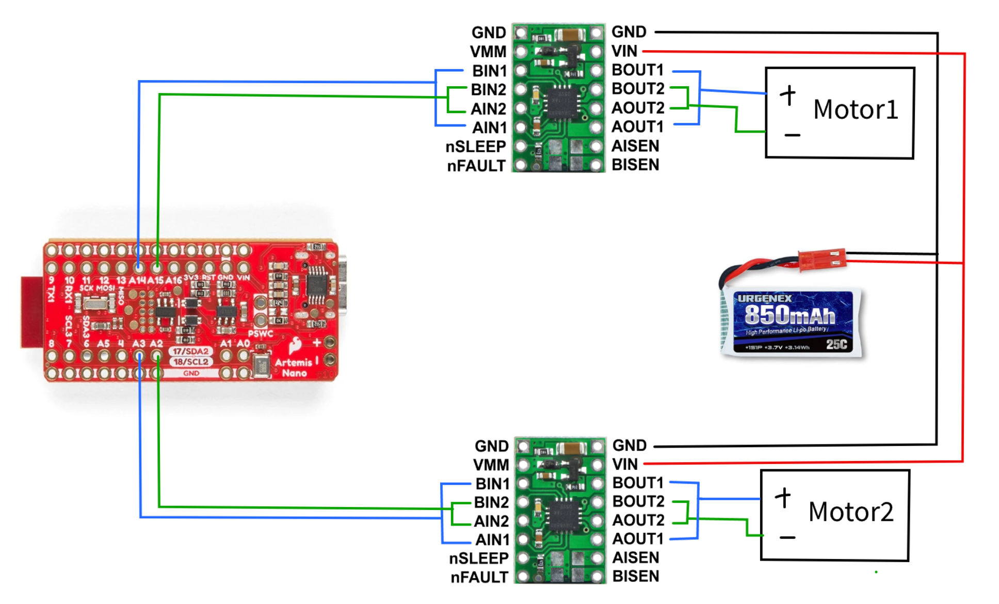

# LAB 4 - MAE4190 FAST ROBOTS

Welcome to lab 4 of fast robots! In this lab we change from manual to open loop control of the car with the Artemis and two dual motor drivers.

## Prelab


Diagram with your intended connections between the motor drivers, Artemis, and battery (with specific pin numbers)
Battery discussion

In your lab write-up, discuss/show how you decide to hook up/place the motor drivers.
analog pins
We ask you to power the Artemis and the motor drivers/motors from separate batteries. Why is that?
length of wires
the battery must be detachable for charging --> solder to connectors


Testing the motors going forwards and backwards individually::

```C++
void loop() {
  // put your main code here, to run repeatedly:

  //DRIVE1 - forwards
  Serial.println("DRIVE1 - forwards");
  analogWrite(MOTOR1PIN1, speed);
  //analogWrite(MOTOR2PIN1, speed);
  delay(3000);

  analogWrite(MOTOR1PIN1, 0);
  //analogWrite(MOTOR2PIN1, 0);
  delay(3000);

  //DRIVE1 - backwards
  Serial.println("DRIVE1 - backwards");
  analogWrite(MOTOR1PIN2, speed);
  //analogWrite(MOTOR2PIN1, speed);
  delay(3000);

  analogWrite(MOTOR1PIN2, 0);
  //analogWrite(MOTOR2PIN1, 0);
  delay(3000);

  //DRIVE2 - forwards
  Serial.println("DRIVE2 - forwards");
  //analogWrite(MOTOR1PIN1, speed);
  analogWrite(MOTOR2PIN1, speed);
  delay(3000);

  //analogWrite(MOTOR1PIN1, 0);
  analogWrite(MOTOR2PIN1, 0);
  delay(3000);

  //DRIVE2 - backwards
  Serial.println("DRIVE2 - backwards");
  //analogWrite(MOTOR1PIN1, speed);
  analogWrite(MOTOR2PIN2, speed);
  delay(3000);

  //analogWrite(MOTOR1PIN1, 0);
  analogWrite(MOTOR2PIN2, 0);
  delay(3000);
}
```
[](https://www.youtube.com/watch?v=zi30M5Ju1Ow)

Both motors spinning at the same time

[](https://www.youtube.com/watch?v=SAu9FWAS-v8)


The 850mAh battery is in the original battery compartment on the other side of the car.

This is more of a temporary setup because I will most likely be cutting some wires and resoldering them to make them shorter and more space efficient and to reduce noise. I also need to elongate the wires for the ToF sensor if I am to do the configuration in which they are on the front and back of the car, since the given QWIIC cables are not long enough.


in air at 30: one side runs, other doesn't; 35 barely moving other wheel

Starting from rest: 35 (insert vid)

While running (varying speeds while already running):

i think it depends on the floor material though since mine is heavily carpeted, but it moves much better on the smoother tile of my hallway.
Unfortunately the lowest limit PWM value starting from rest and while in motion seem to be about to same as the left wheels really struggle to rotate at the same speed as the right even as the car is already moving.

Turning:
100 for weak wheel --> very wide axis though. (insert vid)
90 for strong wheel 

Lab Tasks
Picture of your setup with power supply and oscilloscope hookup
Power supply setting discussion
**Include the code snippet for your analogWrite code that tests the motor drivers
Image of your oscilloscope
**Short video of wheels spinning as expected (including code snippet it’s running on)
**Short video of both wheels spinning (with battery driving the motor drivers)
**Picture of all the components secured in the car
**Consider labeling your picture if you can’t see all the components
Lower limit PWM value discussion
Calibration demonstration (discussion, video, code, pictures as needed)
Open loop code and video