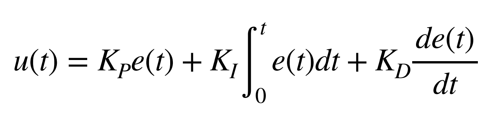
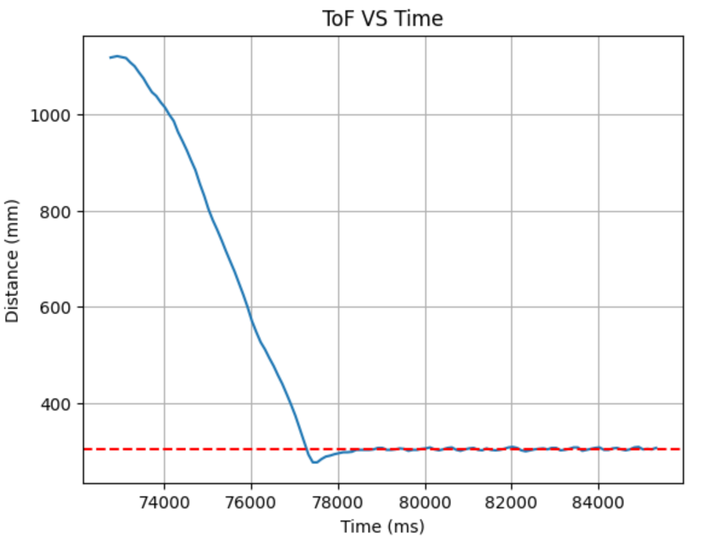
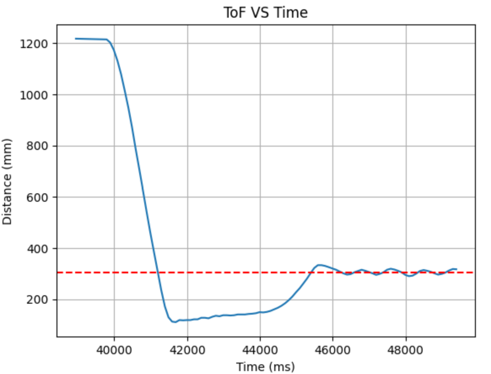
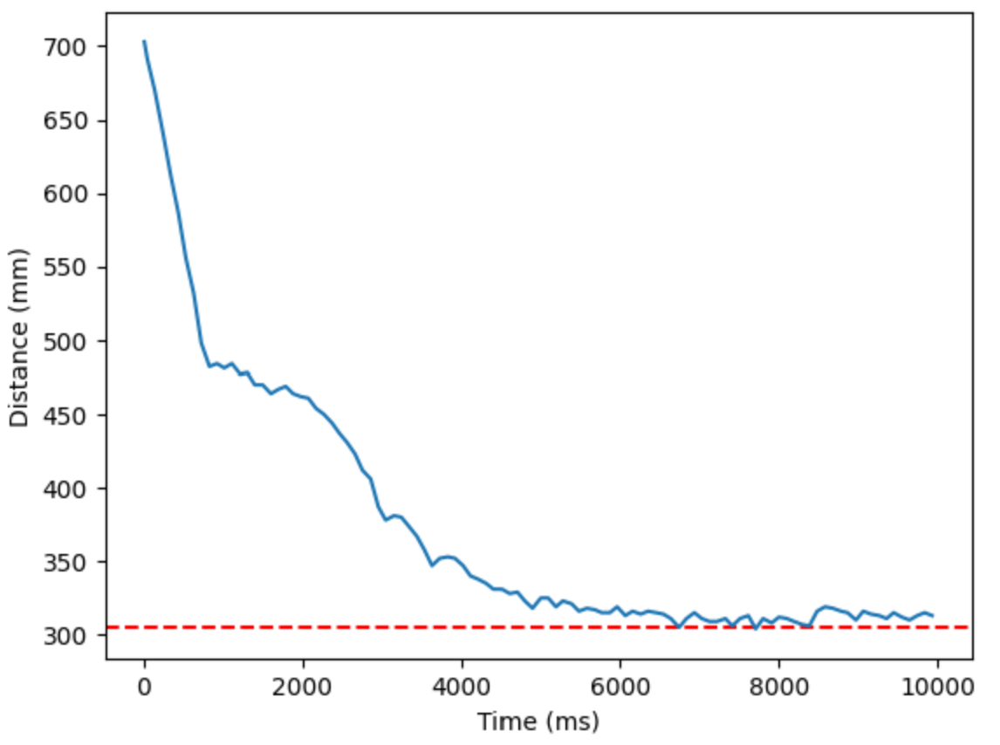
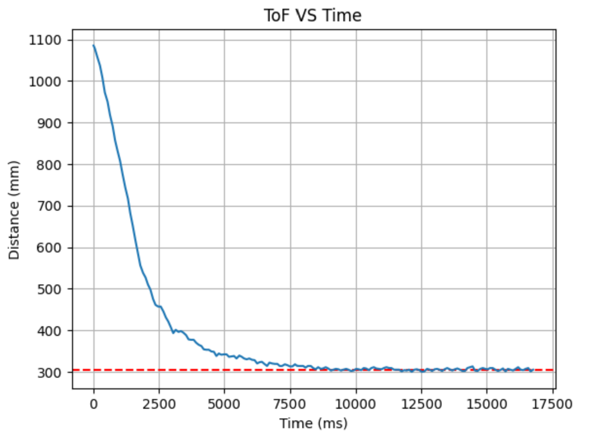
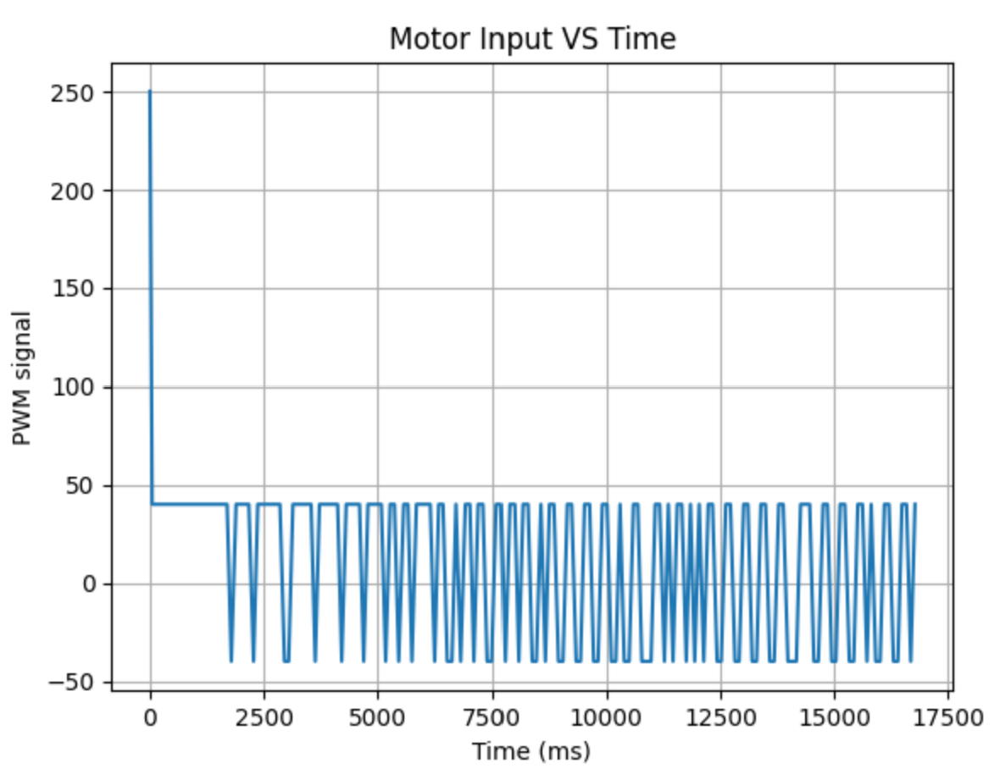

# LAB 5 - MAE4190 FAST ROBOTS

Welcome to lab 5 of fast robots! In this lab we will be implementing linear PID control on our car. The goal of this lab is for the car to be able to stop about 1 ft (305mm) away from a wall, regardless of starting position and any disturbances.

## Prelab

In order to simply the debugging process, I made three Arduino to BLE commands: starting the PID control, stopping PID controls, sending data from PID run.

```C++
/*
* Allow car to be turned on via bluetooth
*/
case START_CONTROL:

    float set_Kp, set_Kd, set_Ki, set_dis;

    robot_cmd.get_next_value(set_Kp);
    robot_cmd.get_next_value(set_Kd);
    robot_cmd.get_next_value(set_Ki);
    robot_cmd.get_next_value(set_dis);
            
    Kp = set_Kp;
    Kd = set_Kd;
    Ki = set_Ki;
    target_dis = set_dis;

    tindex = 0;
    integral = 0;
    prev_error = 0;
    start_PID = true;

    break;
```

I wanted to be able to change the PID parameter values easily without burning the code on the board every time, hence they will be obtained from the python BLE input.

```C++
case STOP_CONTROL:

    start_PID = false;
    control_stop();

    Serial.println("PID stopped");
            
    break;
```

Aside from the stopping protocol over BLE, I also implemented a hardstop that sets all PWM signals to 0 if the while (central.connected()) loop ends, meaning that the Artemis board has disconnected from bluetooth.


```C++
        case SEND_PID_DATA:

            for (int tindex = 0; tindex < tindex_max; tindex++){
                
                tx_estring_value.clear();
                //send time data
                tx_estring_value.append((float)time_doc[tindex]);
                tx_estring_value.append(",");
                //send distance data
                tx_estring_value.append((float)distance_doc[tindex]);
                tx_estring_value.append(",");
                //send error
                tx_estring_value.append((float)error_doc[tindex]);
                tx_estring_value.append(",");
                //send motor input
                tx_estring_value.append((float)motor_input[tindex]);
                tx_estring_value.append(",");
                //send PID input
                tx_estring_value.append((float)PID_doc[tindex]);
                tx_estring_value.append(",");
                //tof freq
                tx_estring_value.append((float)tof_interval[tindex]);
                tx_estring_value.append(",");

                tx_characteristic_string.writeValue(tx_estring_value.c_str());
                delay(1000);

            }

            break;
```

This is the code for the receiving end on Python. 

```python
time_array = []
dist_array = []
error_array = []
motor_array = []
PID_array = []
tof_freq = []

def notifyBle(uuid, data):
    data = data.decode()
    parts = data.split(",")
    
    time_array.append(float(parts[0]))
    dist_array.append(float(parts[1]))
    error_array.append(float(parts[2]))
    motor_array.append(float(parts[3]))
    PID_array.append(float(parts[4]))
    tof_freq.append(float(parts[5]))
```

```python
ble.send_command(CMD.START_CONTROL, "0.06|0.02|0|305")
#Kp|Kd|Ki|target_dis
print("car started")
time.sleep(30)

ble.send_command(CMD.STOP_CONTROL, "")
print("car stopped")
time.sleep(5)

ble.send_command(CMD.SEND_PID_DATA, "")
print("data got")
```

## Lab Procedure

### Position Control

To implement position control, there are three parameters Kp, Kd and Ki to be considered. The equation to calculate the motor inputs from feedback control is as follows:



I decided to start with a PID controller as it gives me more flexibility in achieving the best results, able to reduce oscillations or overshoot. If I find that a certain type of control is not benefitting the car's performance much, I can always set that gain to 0.

#### Kp control:
starting out with only proportional control, starting Kp at around 0.05 to try with a very mild controller



0.04:
There is not much point in placing the Kp value lower than 0.05 as it is already a very gentle controller, and after trying 0.04 and getting the values of the motor inputs, most of it is capped at the lower limit of 40. I tried a more aggressive Kp instead.

[](https://www.youtube.com/watch?v=xresUaMSk9s)

0.09:
This is about the largest I can make Kp without the car hitting the wall. As we can see the overshoot is much larger and it takes a lot longer to recover and oscillate around the desired location.

[](https://www.youtube.com/watch?v=dVeLnWslfZU)



Since the 0.05 controller is about right for accuracy, but a little weak for textured floor, I chose Kp = 0.06.

0.06

#### Kd control:

trying to reduce oscillation --> starting with 0.1, more aggressive; oops too aggressive, my car ran into the wall
down to 0.05: better, still running into the wall
settled at 0.01, enough to reduce oscillations, but not enough to fully ram into wall. Able to recover

unfortunately at this point my tof sensor broke and when .getDistance() was run returns one constant distance. I had to switch to my other sensor. Hope this one doesn't break!

controlling overshoot with derivative

0.05|



#### Ki control:

It was already pretty accurate, but sometimes it had some trouble recovering back to 305mm when pushed too close to the wall.
need anti wind up --> small Ki, overshooting a lot because it's cumulative

[](https://www.youtube.com/watch?v=6McXPFOPtKU)

0.0001|


Code for PID:

```C++
PIDResult PID_calculation(float distance)
{
    unsigned long curr_time = millis();
    float dt = (curr_time - prev_time)/1000.0;
    prev_time = curr_time;
    //calculate error for proportional
    float curr_error = distance - target_dis;
    //calculate integral term
    integral += curr_error * dt;
    //anti-wind up
    integral = constrain(integral, -300, 300); //change this when Ki is decided
    //calculate derivative term
    derivative = (curr_error - prev_error)/dt;
    prev_error = curr_error;
    //calculate PID
    float u = Kp * curr_error + Ki * integral  + Kd * derivative;

    PIDResult r;
    r.u_r = u;
    r.error_r = curr_error;
    r.time_r = curr_time;
    return r;
}
```

Motor code:

```C++

void PID_forward(float PID_u, int i){
    
    float adj_speed = PID_u * 1.4; //adjusted for the weaker motor
    float norm_speed = PID_u;

    //make sure it doesn't go below the deadband or exceed the max PWM signal
    adj_speed = constrain(adj_speed, 40, 255); //40 to give it some cushion from the actual lowest value, make sure it actually moves the car
    norm_speed = constrain(norm_speed, 40, 255);

    analogWrite(MOTOR1PIN1, adj_speed);
    analogWrite(MOTOR2PIN1, norm_speed);
    analogWrite(MOTOR1PIN2, 0);
    analogWrite(MOTOR2PIN2, 0);
    motor_input[i] = adj_speed;

}

void PID_backward(float PID_u, int i){
    
    float adj_speed = abs(PID_u) * 1.4; //adjusted for the weaker motor
    float norm_speed = abs(PID_u);

    //make sure it doesn't go below the deadband or exceed the max PWM signal
    adj_speed = constrain(adj_speed, 40, 255); //40 to give it some cushion from the actual lowest value, make sure it actually moves the car
    norm_speed = constrain(norm_speed, 40, 255);

    analogWrite(MOTOR1PIN1, 0);
    analogWrite(MOTOR2PIN1, 0);
    analogWrite(MOTOR1PIN2, adj_speed);
    analogWrite(MOTOR2PIN2, norm_speed);
    motor_input[i] = adj_speed;
}
```

[](https://www.youtube.com/watch?v=80r9rGjIRYE)

This is the final performance of my car with the given PID parameters. In the video it demonstrates that it stops about 1 ft from the wall, and when I shift it further away or closer, it is able to recover back to about 1 ft.




These are the final ToF sensor outputs and the motor inputs of my PID controls. The motor inputs look a little strange due to the relatively gentle controls producing inputs that are manually constrained to have magnitudes higher than 40. Hence the motor controls keep spiking back and forwards as it performs fine adjustments to rearrange itself back into the 305mm position.

### Extrapolation
TOF sampling frequency

```C++
//Testing for ToF sampling frequency
    prev_sensor_time = millis();
    tof_interval[tindex] = dt_ex;
```
around on average 97ms intervals

extrapolation
```C++
else{
    distanceSensor2.clearInterrupt();
    float ex_dist = prev_dist + d_dist/dt_ex * (millis()-prev_sensor_time);
    PIDResult r = PID_calculation(ex_dist);
    prev_dist = ex_dist;

    float u_store = r.u_r;
    float curr_error_store = r.error_r;
    float curr_time_store = r.time_r;

    time_doc[tindex] = curr_time_store;
    distance_doc[tindex] = ex_dist;
    PID_doc[tindex] = u_store;
    error_doc[tindex] = curr_error_store;

    if (u_store > 0){
        PID_backward(u_store, tindex);
    }else if (u_store < 0){
        PID_forward(u_store, tindex);
    }

    tindex++;
}
```

**
P/I/D discussion (Kp/Ki/Kd values chosen, why you chose a combination of controllers, etc.)
Range/Sampling time discussion
Graphs, code, videos, images, discussion of reaching task goal
Graph data should include Tof vs time and Motor input vs time (and whatever helps with debugging)


## References

I took reference from Jennie Redrovan's lab report, and I worked briefly with Apurva Hanwadikar.