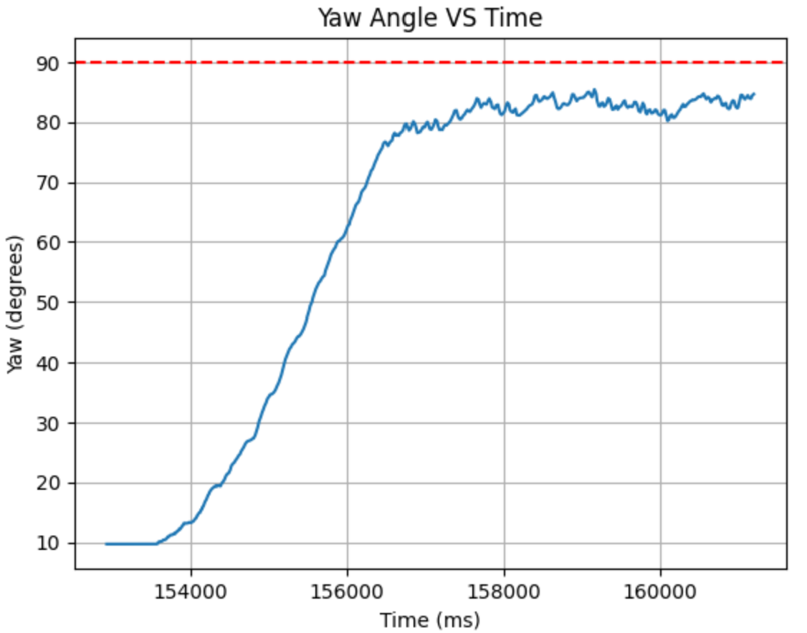

# LAB 6 - MAE4190 FAST ROBOTS

Welcome to lab 6 of fast robots! In this lab we will be implementing orientation PID control on our car. This lab will involve controlling the yaw of your robot using the IMU.

## Prelab

The set up for my Bluetooth data transmission and debugging system is similar to lab 5. I created three commands for starting the orientation control, stopping the control over bluetooth, as well as sending the data respectively.

```C++
/*
        start PID orientation control
        */
        case START_ORIENT:
            
            success = robot_cmd.get_next_value(target_angle);
                if(!success)
                    return;
            success = robot_cmd.get_next_value(Kp);
                if(!success)
                    return;
            success = robot_cmd.get_next_value(Kd);
                if(!success)
                    return;
            success = robot_cmd.get_next_value(Ki);
                if(!success)
                    return;

            tindex = 0;
            integral = 0;
            prev_error = 0;
            prev_time = millis();
            prev_sensor_time = millis();
            start_orient = true;

            break;
```

```C++
/*
         * Allowing the car to be stopped via BLE
         */
        case STOP_ORIENT:

            start_orient = false;
            control_stop();

            Serial.println("PID stopped");
            
            break;
```

```C++
        /*
         * Send data of PID controls through BLE
         */
        case SEND_ORIENT_DATA:

            for (int tindex = 0; tindex < tindex_max; tindex++){
                
                tx_estring_value.clear();
                //send time data
                tx_estring_value.append((float)time_doc[tindex]);
                tx_estring_value.append(",");
                //send yaw data
                tx_estring_value.append((float)yaw_doc[tindex]);
                tx_estring_value.append(",");
                //send error
                tx_estring_value.append((float)error_doc[tindex]);
                tx_estring_value.append(",");
                //send PID input
                tx_estring_value.append((float)PID_doc[tindex]);
                tx_estring_value.append(",");
                //send motor input
                tx_estring_value.append((float)motor_input[tindex]);
                tx_estring_value.append(",");

                tx_characteristic_string.writeValue(tx_estring_value.c_str());

            }

            break;
```

The hard stop after BLE disconnects is done the same as Lab 5.

Although now the two motors will be operating in opposite directions, their motor input will be basically the same (aside from calibration for weaker motors), just implemented on different motor pins.

The python code receiving data is as follows:

```python
time_array = []
yaw_array = []
error_array = []
PID_array = []
motor_array = []

def notifyBle(uuid, data):
    data = data.decode()
    parts = data.split(",")
    
    time_array.append(float(parts[0]))
    yaw_array.append(float(parts[1]))
    error_array.append(float(parts[2]))
    PID_array.append(float(parts[3]))
    motor_array.append(float(parts[4]))
    print(yaw_array)
    #print(motor_array)
    #print(PID_array)
    print(error_array)
```

```python
ble.send_command(CMD.START_ORIENT, "90|1.5|1.5|0")
print("start orient")
time.sleep(20)

ble.send_command(CMD.STOP_ORIENT, "")
print("stopped orient")
time.sleep(2)

ble.send_command(CMD.SEND_ORIENT_DATA, "")
print("got yaw data")
time.sleep(20)
ble.stop_notify(ble.uuid['RX_STRING'])
```

This allows me to change the PID values and the reference target angle easily without updating the code on the Artemis board.


## Lab Tasks

#### Digital Motion Processor (DMP)

As I discovered from previous labs, my gyroscope has a pretty significant drift. Hence, I need to use the digital motion processor (DMP) for sensor fusion to mitigate the individual drawbacks of each sensor.

The DMP is capable of error and drift correction by fusing readings from the ICM’s 3-axis gyroscope, 3-axis accelerometer, 3-axis magnetometer/compass. For our purposes we will mostly only be fusing the accelerometer and gyroscope readings.

The maximum rotational velocity that the gyroscope can read by default, according to specs documentaiton, is about 250 degrees per second. This is a little slow for fast adjustments, but is supplemented by the DMP as it uses 2000 degrees per second.

I followed the instructions for the DMP. This is the code that I added to my loop:

```C++
//DMP
                icm_20948_DMP_data_t data;
                myICM.readDMPdataFromFIFO(&data);

                // Is valid data available?
                if ((myICM.status == ICM_20948_Stat_Ok) || (myICM.status == ICM_20948_Stat_FIFOMoreDataAvail)) {
                    // We have asked for GRV data so we should receive Quat6
                    if ((data.header & DMP_header_bitmap_Quat6) > 0) {
                        double q1 = ((double)data.Quat6.Data.Q1) / 1073741824.0; // Convert to double. Divide by 2^30
                        double q2 = ((double)data.Quat6.Data.Q2) / 1073741824.0; // Convert to double. Divide by 2^30
                        double q3 = ((double)data.Quat6.Data.Q3) / 1073741824.0; // Convert to double. Divide by 2^30
```

To convert quaternion data into euler angles for yaw (reference from Example7):

```C++
double q0 = sqrt(1.0 - ((q1 * q1) + (q2 * q2) + (q3 * q3)));

double qw = q0; // See issue #145 - thank you @Gord1
double qx = q2;
double qy = q1;
double qz = -q3;

double t3 = +2.0 * (qw * qz + qx * qy);
double t4 = +1.0 - 2.0 * (qy * qy + qz * qz);
double curr_angle = atan2(t3, t4) * 180.0 / PI; //from radians to degrees
yaw_doc[tindex] = curr_angle;
```



P/I/D discussion (Kp/Ki/Kd values chosen, why you chose a combination of controllers, etc.)

--> known from previous labs that my car has difficulty turning, amp up the parameters for more power

after more experimentation I decided it wasn't the PID control giving it a steady state error, it was due to the overpowering of one motor such that the other was not strong enough to correct it no matter how large the ki --> lead to overshoot, decreasing ki

I think the Kd is making it spin --> my initial kd value is very high due to the large differentce???

Final values:
ble.send_command(CMD.START_ORIENT, "90|2.2|0.3|0.0001")

[](https://www.youtube.com/watch?v=xresUaMSk9s)

Range/Sampling time discussion
Graphs, code, videos, images, discussion of reaching task goal
Graph data should at least include theta vs time (you can also consider angular velocity, motor input, etc)


Difficulties:
wow my motor inputs are very different, one side is significantly weaker than the other, and this is less serious during linear motion or turning on a wide arc but calibrating and tuning it to turn in place was a nightmare:
adjusted speeds 1.4 to 2.5 ratio, moving the lower limit of the weaker motor to 120

```C++
void PID_forward(float PID_u, int i){ 
    
    float adj_speed = PID_u * 2.5; //adjusted for the weaker motor
    float norm_speed = PID_u;

    //make sure it doesn't go below the deadband or exceed the max PWM signal
    adj_speed = constrain(adj_speed, 120, 255);
    norm_speed = constrain(norm_speed, 70, 255);

    analogWrite(MOTOR1PIN1, 0);
    analogWrite(MOTOR2PIN1, norm_speed);
    analogWrite(MOTOR1PIN2, adj_speed);
    analogWrite(MOTOR2PIN2, 0);
    motor_input[i] = adj_speed;

}
```
I might need two different speed controls for driving and turning when we are to combine those two in the future.


some future improvements:
might tape the wheels to make turning a little easier and with less motor power
speeding up the minor adjustments