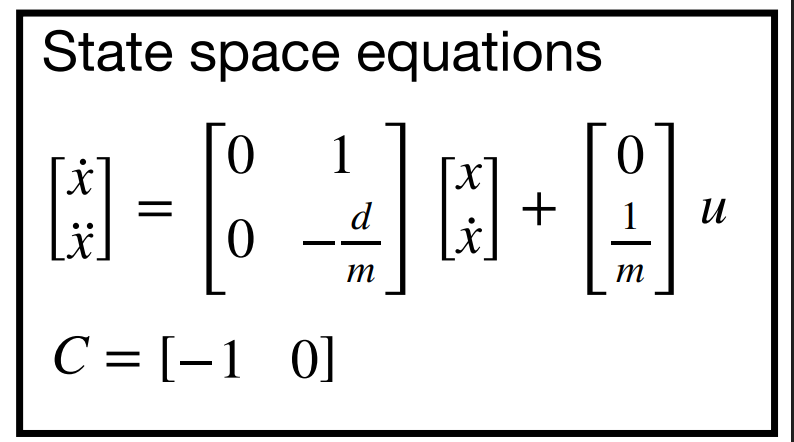

# LAB 7 - MAE4190 FAST ROBOTS

Welcome to lab 7 of fast robots! In this lab we will be implementing the Kalman filter on our car controls.

## Lab Tasks

In order to implement a Kalman Filter, we will first be needing a state space model of the car.

#### Testing for Drag and Momentum

