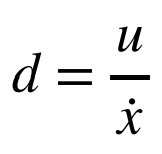
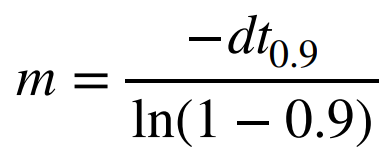
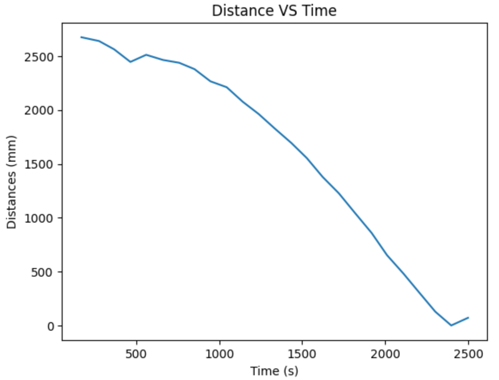
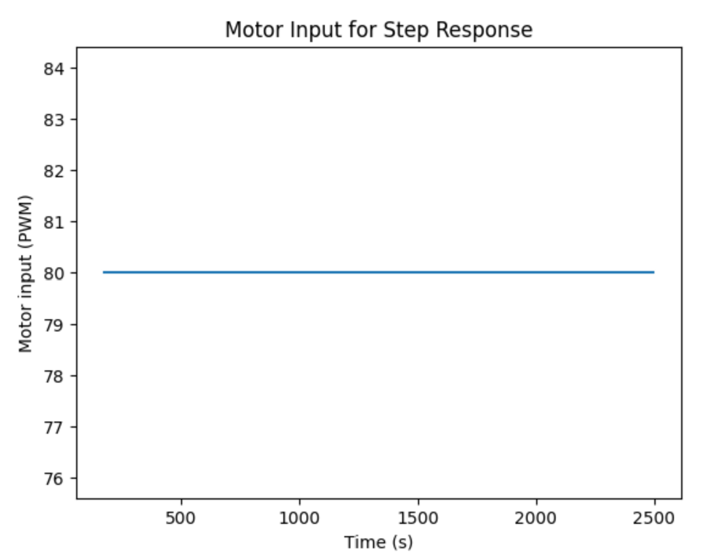
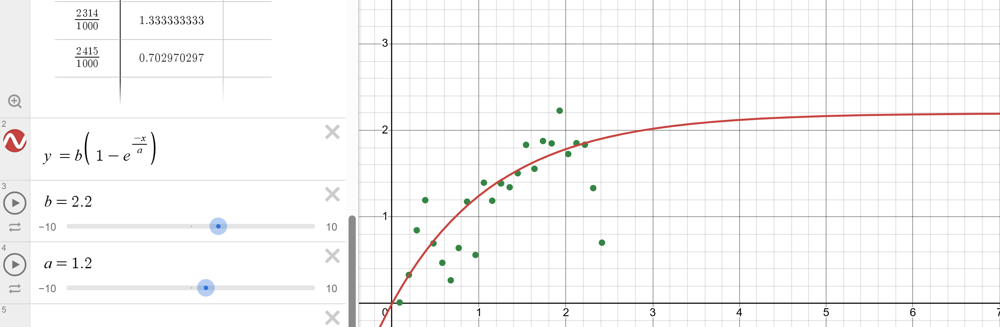

# LAB 7 - MAE4190 FAST ROBOTS

Welcome to lab 7 of fast robots! In this lab we will be implementing the Kalman filter on our car controls.

## Lab Tasks

In order to implement a Kalman Filter, we will first be needing a state space model of the car.


To get the estimates for our A and B matrices, we will therefore need the car's drag and momentum.

### 1. Testing for Drag and Momentum

Using a step response and giving the motors a constant input, I obtained ToF sensor data with which I calculated velocity to plot against time. From the plots I obtained the steady state velocity and 90% rise time for the d and m calculations:




I chose the step response input to be 80 (and the calibrated speed 112)
placed car 3m from wall --> far enough to reach steady state, but close enough so that tof sensor does not lose range (still could be a bit farther as it still hit the wall before fully reaching stable steady state)
active braking


```C+++
            while (time_interval < step_time) {
                time_interval = millis() - start_time;

                //tof sensor
                if (distanceSensor2.checkForDataReady()){
                    drag_dis = distanceSensor2.getDistance();
                    distanceSensor2.clearInterrupt();
                    distance_doc[tindex] = drag_dis;
                    time_doc[tindex] = millis() - start_time;
                    tindex++;
                }

                //active braking
                if (drag_dis < target_dis) {
                    control_stop();
                    return;
                }

                //drive forwards
                analogWrite(MOTOR1PIN1, step_speed);
                analogWrite(MOTOR2PIN1, step_speed * 1.4);
                analogWrite(MOTOR1PIN2, 0);
                analogWrite(MOTOR2PIN2, 0);

            }

            control_stop();
            delay(1000);
            distanceSensor2.stopRanging();
```

Decided to save my data with a csv file so that my data is not lost when the kernel resets

To calculate the velocity I changed the stored data into numpy arrays for easier calcs. 

```python
dd = np.diff(dist_array)
dt = np.diff(time_array)
vel_array = - dd / dt
```

since the distance reading becomes smaller, the np.diff returns negative numbers and hence the added sign during the velocity calculation.





VELOCITY OUTPUT --> plotted in desmos from raw data to curve fit and find variables from fitted graph equation



Fitted exponential curve

b = 2.2 is my steady state velocity
a = 1.2 is the tau, the time constant

To find the 90% rise time, I found the point at which velocity reaches 1.98 m/s, which is about 2.763s.

With this obtained data, I calculated the following for my matrices:

```math
\d = \frac{u}{dx} = 0.036364

\m =  \frac{- d \cdot t(0.9)}{ln(0.1)} = 0.043635
```


### 2. Initialize KF

My sampling rate:
According to previous tests of the ToF sampling rate, it's on average about in 100ms intervals. The Delta_t should be 0.1 then.

Matrix explanation + discretization

```python
d = 0.036364
m = 0.043635
Delta_t = 0.1
#dimensions of state space
n = 2

A = np.array([[0, 1], [0, d/m]])
B = np.array([[0], [1/m]])

Ad = np.eye(n) + Delta_t * A
Bd = Delta_t * B
```

C state explanation

```python
C = np.array([[-1,0]])
```

initializing state vector:
```python
TOF = np.array(dist_array)
x = np.array([[-TOF[0]],[0]])
```

initialize process noise and sensor noise covariance matrices

I started off with the equations for the position, velocity and measurement uncertainty shown in lecture:

```math
\sigma_1 = \sqrt{10^2 \cdot \frac{1}{\Delta T}}

\sigma_2 = \sqrt{10^2 \cdot \frac{1}{\Delta T}}
```

Both values were set to 31.6mm initially and tweaked later with trial and error.


11am-3pm class + shift, REMEMBER TO GO GET POSTERS
3-5pm coding
5-7pm rover (encoders?)
Finish lab 7 today or I will explode

to be of similar size to the PWM value you used in Lab 5 (to keep the dynamics similar). Pick something between 50%-100% of the maximum u.
