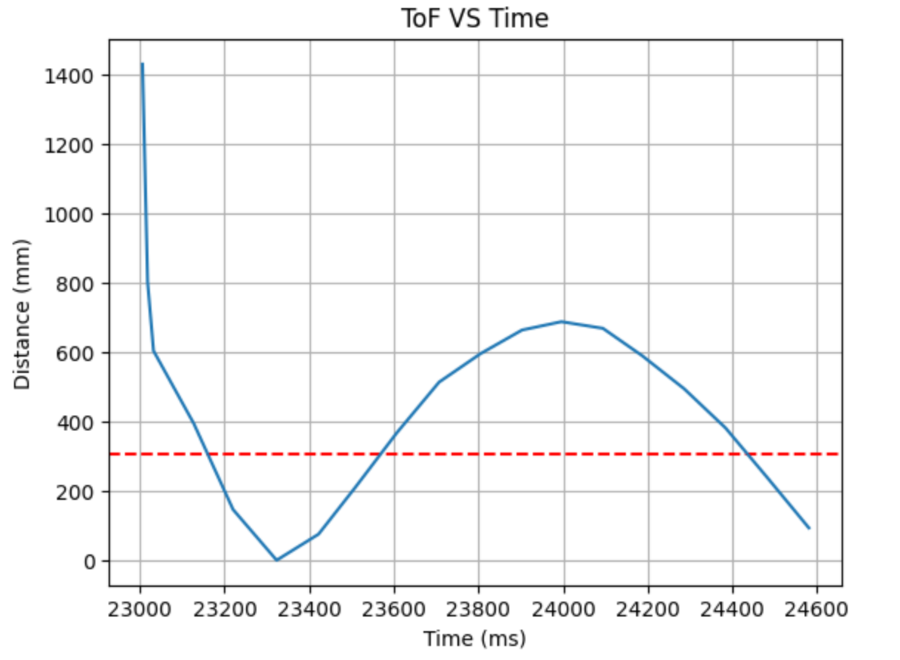
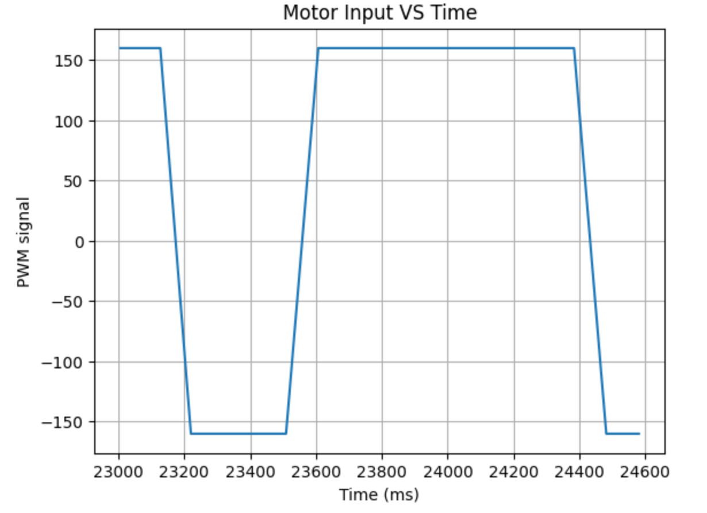
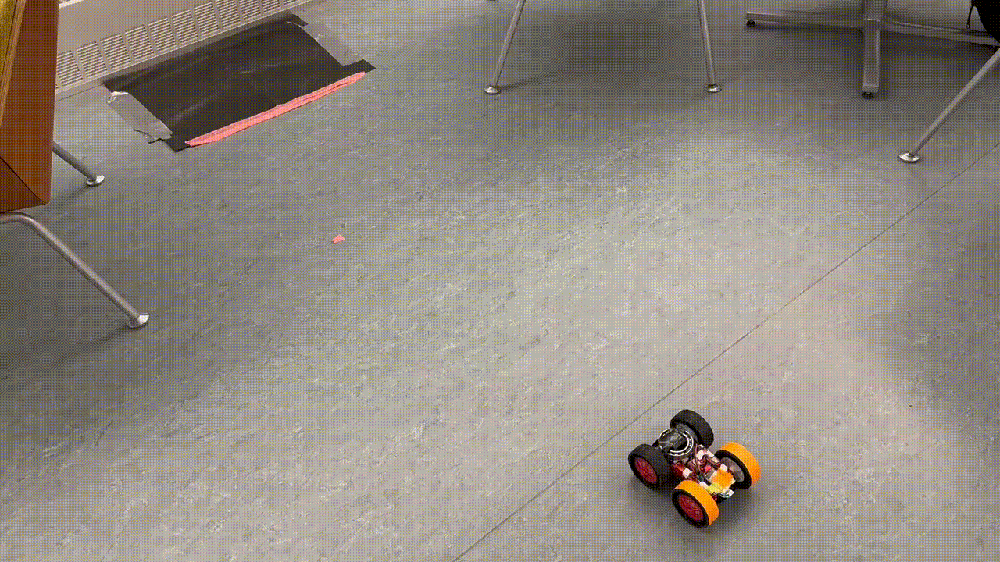
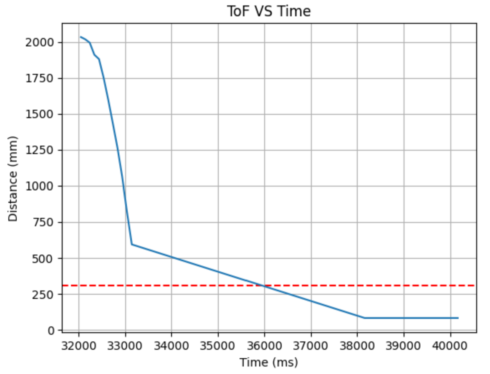
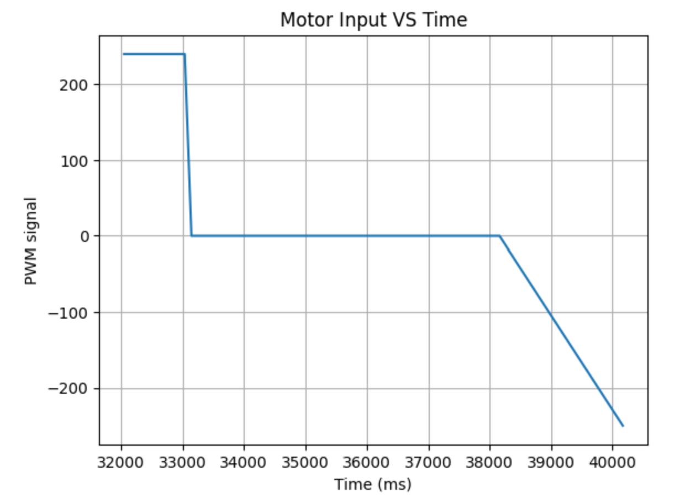

# LAB 8 - MAE4190 FAST ROBOTS

Welcome to lab 8 of fast robots! In this lab we will be doing stunts with our cars!

I chose to do the flip

code:

```C++
        case START_STUNT:

            start_STUNT = true;

            break;
        /*
         * Allowing the car to be stopped via BLE
         */
        case STOP_STUNT:

            start_STUNT = false;
            control_stop();

            Serial.println("Stunt stopped");
            
            break;
        
        case SEND_STUNT_DATA:

            for (int tindex = 0; tindex < tindex_max; tindex++){
                
                tx_estring_value.clear();
                //send time data
                tx_estring_value.append((float)time_doc[tindex]);
                tx_estring_value.append(",");
                //send distance data
                tx_estring_value.append((float)distance_doc[tindex]);
                tx_estring_value.append(",");
                //send motor input
                tx_estring_value.append((float)motor_input[tindex]);

                tx_characteristic_string.writeValue(tx_estring_value.c_str());
                delay(1000);

            }

            break;
```


interestingly at almost max PWM the two motors run pretty similarly, I originally had the 1.4 ratio between them, but it just veered off to the side. I did resolder one of the motor input wires between this lab and the previous few since the wire broke, so it could have been bad connection as well?

Made a sticky mat
Added bearing to front of car

flipped starting position since back of car too heavy by itself: would not flip even hitting a wall




Added a second bearing on the car
taped the back wheels for less friction
increased speed


```C++
//stunt control
            if (start_STUNT == true && tindex < tindex_max) {
                unsigned long timer = millis();
                while ((millis()-timer < 900)){
                    //if (distanceSensor2.checkForDataReady()){
                        //float distance1 = distanceSensor2.getDistance(); //Get the result of the measurement from the sensor
                        //distance_doc[tindex] = distance1;
                        //Serial.print(distance1);
                        //distanceSensor2.clearInterrupt();

                        analogWrite(MOTOR1PIN1, 240);
                        analogWrite(MOTOR2PIN1, 240);
                        analogWrite(MOTOR1PIN2, 0);
                        analogWrite(MOTOR2PIN2, 0);

                        time_doc[tindex] = millis();

                        tindex++;
                    //}
                }
                analogWrite(MOTOR1PIN1, 1);
                analogWrite(MOTOR2PIN1, 1);
                analogWrite(MOTOR1PIN2, 0);
                analogWrite(MOTOR2PIN2, 0);
                //delay(10);

                control_stop();

                analogWrite(MOTOR1PIN1, 0);
                analogWrite(MOTOR2PIN1, 0);
                analogWrite(MOTOR1PIN2, 250);
                analogWrite(MOTOR2PIN2, 250);
                delay(2000);

                analogWrite(MOTOR1PIN1, 0);
                analogWrite(MOTOR2PIN1, 0);
                analogWrite(MOTOR1PIN2, 0);
                analogWrite(MOTOR2PIN2, 0);
                delay(3000);

            }
```


[](https://www.youtube.com/watch?v=vd0Yp2gF3XI)


### Distance based flip

```C++
//stunt control
            if (start_STUNT == true && tindex < tindex_max) {
                if (distanceSensor2.checkForDataReady()){
                    float distance1 = distanceSensor2.getDistance(); //Get the result of the sensor
                    distance_doc[tindex] = distance1;
                    distanceSensor2.clearInterrupt();
                    time_doc[tindex] = millis();
                    if (distance1 > 805){

                        analogWrite(MOTOR1PIN1, 250);
                        analogWrite(MOTOR2PIN1, 250);
                        analogWrite(MOTOR1PIN2, 0);
                        analogWrite(MOTOR2PIN2, 0);                        

                        tindex++;

                    } else if (distance1 <= 805){
                        analogWrite(MOTOR2PIN1, 1);
                        analogWrite(MOTOR1PIN1, 1);
                        analogWrite(MOTOR1PIN2, 0);
                        analogWrite(MOTOR2PIN2, 0);

                        control_stop();

                        analogWrite(MOTOR1PIN1, 0);
                        analogWrite(MOTOR2PIN1, 0);
                        analogWrite(MOTOR1PIN2, 250);
                        analogWrite(MOTOR2PIN2, 250);
                        delay(2000);

                        analogWrite(MOTOR1PIN1, 0);
                        analogWrite(MOTOR2PIN1, 0);
                        analogWrite(MOTOR1PIN2, 0);
                        analogWrite(MOTOR2PIN2, 0);
                        delay(5000);
                    }

                }
            }
```

I started off with 305 as the benchmark for distance detection, but the TOF sensor was not fast enough to react with the flip. I incremented it in 100mm intervals and found that 805 was the distance that could reliably flip without colliding with the wall.




it likes to turn sideways a little bit after flipping, I think because the speed at which the two wheels stop are different, one stops slower than the other, causing it to turns

[](https://www.youtube.com/watch?v=yU46CBN-2M4)

[](https://www.youtube.com/watch?v=M9IMlJxRE2o)

[](https://www.youtube.com/watch?v=AQgau0eaHMU)

you can see it getting better! I added a slight delay to one of the wheels stopping, as well as added a difference in speeds when they start back up again to drive towards me.





There is still a bit of an unwanted pivot, but unfortunately the mat was not sticky enough to perform my stunt anymore after too many tries. So I will be back when I get a better calibration on another sticky mat, or perhaps a DIY mat if I can find materials.