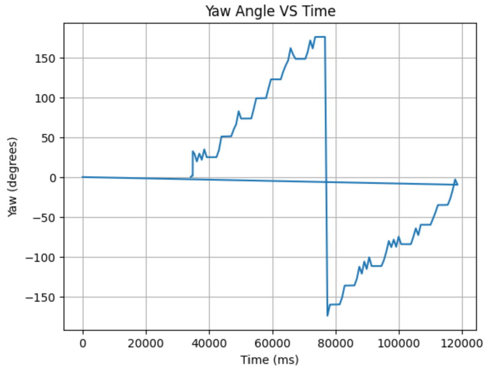
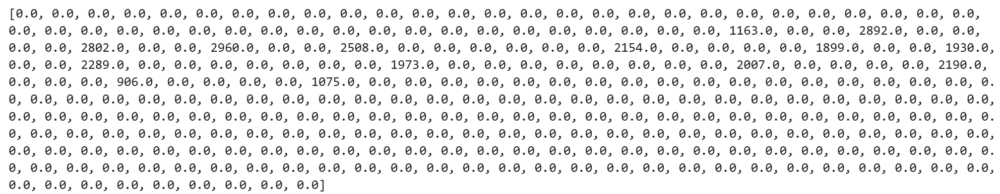

# LAB 9 - MAE4190 FAST ROBOTS

This is lab 9 of fast robots. In this lab, our objective is to map out a static room. To build the map, we will place your robot in a couple of marked locations around the lab, and have it spin around its axis while collecting ToF readings.

### Control

I chose to perform this task with a PID orientation control.

I added tape to my wheels as from previous labs it is known that my car has trouble turning and requires a lot of motor power to start the turn. For such a slow speed, precision based turn, I'll need it to be a smoother motion and ideally not giving the motors a burst of power and sending the car to overshoot.

I want the car to be abel to turn 360 regardless of starting orientation


***TO DO:

LAB 9 MAKE CAR ABEL TO TURN 360 REGARDLESS OF STARTING ORIENTATION
debugging:
speed adjustment
angles not matching up due to wrapping/lack thereof
NAN outputs

angle wrapping/PID recognition --> sometimes it thinks it's 180 away (30 to -150 etc)

ble.send_command(CMD.START_SPIN, "1|0.3|0.0001") --> originally 2.2
#Kp|Kd|Ki

motor speed adjusting

the point turn graphs look like that because the spin was not long enough to fill the full array sent over bluetooth


NEED INITIAL ANGLE OFFSET --> TAKEN WHEN TURN STARTED
```C++
/*
        start PID orientation control
        */
        case START_SPIN:
            
            success = robot_cmd.get_next_value(Kp);
                if(!success)
                    return;
            success = robot_cmd.get_next_value(Kd);
                if(!success)
                    return;
            success = robot_cmd.get_next_value(Ki);
                if(!success)
                    return;

            tindex = 0;
            integral = 0;
            prev_error = 0;
            prev_time = millis();
            prev_sensor_time = millis();
            if (myICM.dataReady())
                {
                    myICM.getAGMT();
                    start_angle = myICM.gyrZ();
                }
            step_turn = 1;
            start_orient = true;

            break;
```

angle incremented PID control:

```C++
                        float rot_angle =  start_angle + step_turn * increment;
                        //angle wrapping
                        rot_angle = fmod(rot_angle, 360);
                        if (rot_angle > 180){
                            rot_angle = rot_angle - 360;
                        }
                        
                        Serial.println(yaw);
                        Serial.println(rot_angle);

                        //PID CALCULATION
                        PID_calculation(yaw, rot_angle, tindex);
                        //motor input
                        if (PID_doc[tindex] < 0){
                            PID_forward(PID_doc[tindex], tindex);
                            Serial.print("PID:");
                            Serial.println(PID_doc[tindex]);
                        } else {
                            PID_backward(PID_doc[tindex], tindex);
                            Serial.print("PID:");
                            Serial.println(PID_doc[tindex]);
                        }
```

Distance reading from TOF sensor every 25 degree increments:
```C++
                            if (abs(error_doc[tindex]) <= 2){
                            control_stop();
                            delay(3000);
                            //take tof sensor reading
                            dist_doc[tindex] = distanceSensor2.getDistance(); //Get the result of the measurement from the sensor
                            Serial.println("dist: ");
                            Serial.print(dist_doc[tindex]);
                            distanceSensor2.clearInterrupt();

                            step_turn += 1;
                            // Reset FIFO
                            success &= (myICM.resetFIFO() == ICM_20948_Stat_Ok);
```

Debugging: error calc due to angle wrapping:
added to PID control


```C++
    while (curr_error > 180) curr_error -= 360;
    while (curr_error < -180) curr_error += 360;
```

nan errors --> added constraints for DMP angle calculations
```C++
                        double sum = (q1 * q1) + (q2 * q2) + (q3 * q3);
                        if (sum > 1.0){
                            sum = 1.0;
                        }
                        double q0 = sqrt(1.0 - sum);
```

also this
```C++
                // Only delay between readings if no more data is available
                if (myICM.status != ICM_20948_Stat_FIFOMoreDataAvail) {
                    delay(10);
```

First try:

[](https://www.youtube.com/watch?v=t0iPy6u97GY)

not very on center
motor ratio tuned to 1.7

Point turn demonstration:

[](https://www.youtube.com/watch?v=t0iPy6u97GY)




Try rotating twice or more to see how precise your scans are.
Not very


### Transformation Matrices

sensor frame to robot frame

$$
\begin{aligned}
\sigma_1 &= \sqrt{10^2 \cdot \frac{1}{\Delta T}} = 31.6 \\
\sigma_2 &= \sqrt{10^2 \cdot \frac{1}{\Delta T}} = 31.6 \\
\sigma_3 &= 20
\end{aligned}
$$
[np.cos(alpha),-np.sin(alpha),x], [np.sin(alpha),np.cos(alpha),y], [0,0,1]

robot to world frame


scaling from meters to feet


1. Derivative control spiking in the start (low pass filter with raw gyro data + time step being too small no guard for that)
2. starting angles change to offset